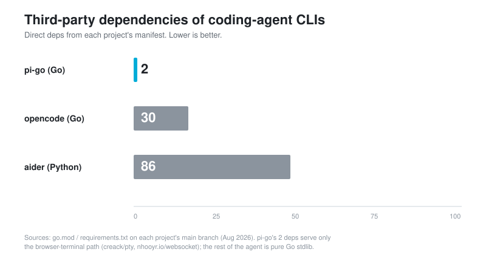

<a id="top"></a>

# pi-go

[](https://github.com/yosukeno/pi-go/actions/workflows/ci.yml)
[](https://goreportcard.com/report/github.com/yosukeno/pi-go)
[](LICENSE)
[](https://go.dev)

**简体中文** | [English](#english)

用 Go 写的极简 coding agent，对标 [pi](https://github.com/earendil-works/pi) 的 harness 设计。

一个 loop、九个工具、一种协议。**除浏览器终端外零第三方依赖**：`creack/pty` 和 `nhooyr.io/websocket` 只服务浏览器终端那条路径（`web/terminal.go` 加 `server.go` 里的升级处），其余全部是 stdlib。

<p align="center">
  
</p>

## 联系方式

- 邮箱：<a href="mailto:wycc2077@qq.com">wycc2077@qq.com</a>
- 微信：扫码加作者交流

<p align="center">
  
</p>

## 安装

需要 Go 1.26 以上。

```bash
git clone https://github.com/yosukeno/pi-go.git && cd pi-go
go build -o pi-go .
```

想装到 `PATH` 里（确保目标目录已在 PATH 中）：

```bash
cd web/ui && npm run build && cd ../.. && go build -o ~/.local/bin/pi-go .
```

## 配置

三件事：API key、provider/model 目录、会话目录。

**1. API key（环境变量）**。密钥只从环境变量读，**不读任何配置文件**。

```bash
export KIMI_API_KEY='sk-...'      # Kimi for Coding 套餐
export ZHIPU_API_KEY='...'        # GLM Coding Plan
```

想让它永久生效，推荐单独放一个文件而不是直接写进 `.zshrc`（`.zshrc` 经常被提交到 dotfiles 仓库或贴给别人看）：

```bash
mkdir -p ~/.pi-go
umask 077
cat > ~/.pi-go/env.sh <<'EOF'
export KIMI_API_KEY='sk-...'
export ZHIPU_API_KEY='...'
EOF
chmod 600 ~/.pi-go/env.sh

echo '[ -f "$HOME/.pi-go/env.sh" ] && source "$HOME/.pi-go/env.sh"' >> ~/.zshrc
```

只配一个也能用，另一个 provider 的模型会在 `-models` 里标成 `not set`。

**2. provider 和模型目录：`~/.pi-go/providers.json`**。要加本地模型服务、公司网关、镜像，或声明模型价格给 `-cost-budget` 用，就在这个文件里写；不写则一切按内置两家跑。完整字段和合并规则见[「模型 → 加自己的 provider 和模型」](#加自己的-provider-和模型pi-goprovidersjson)。

```bash
$PIGO_CONFIG / ~/.pi-go/providers.json
```

**3. 会话目录**。默认在 `~/.pi-go/sessions/`，用 `PIGO_SESSION_DIR` 改；`-resume last` 找的就是这里最新的文件。详见[「会话」](#会话)。

## 快速开始

```bash
pi-go -p "统计当前目录有多少行 Go 代码"
```

不带 `-p` 就进交互模式：

```bash
$ pi-go
pi-go  model=glm-5.2 (zhipu)  cwd=/path/to/project
session /Users/you/.pi-go/sessions/20260802T120000Z-a1b2c3d4.jsonl
/help lists commands (Tab completes them), /exit to quit

> 把 config.go 里的超时从 30s 改成 60s
```

## 两种运行模式

分叉只在启动的最后一步，两种模式共用同一个 agent 实例、同一个 loop、同一个渲染器。区别只是谁提供 prompt、调几次。

**一次性模式** —— 有 prompt 就走这条路，跑完退出。prompt 可以来自 `-p`，也可以来自管道：

```bash
pi-go -p "这个项目的入口在哪"

# 管道内容当作数据，-p 当作指令
cat meeting-notes.md | pi-go -p "提取待办事项，标出负责人"
git diff | pi-go -p "review 这个 diff，只说有问题的地方"

# 只有管道、没有 -p，管道内容本身就是 prompt
echo "解释 Go 的 defer 执行时机" | pi-go
```

管道内容放在指令**前面**，中间空一行。指令在最后，模型对它的注意力最高。

**交互模式** —— stdin 是终端且没有 prompt 时进入。逐行读取，每行一个 prompt，上下文累积。

注意：管道输入会**自动走一次性模式**，不会进 REPL。否则被管进来的文件会被逐行当成一条条 prompt 提交。

## 命令行参数

`pi-go -h` 有完整的中英双语帮助（参数、交互命令、环境变量、示例）。

| 参数 | 说明 |
|---|---|
| `-p <prompt>` | 跑一个 prompt 就退出 |
| `-model <name>` | 模型 id 或别名，默认 `glm-5.2` |
| `-models` | 列出已知模型并退出 |
| `-C <dir>` | 工作目录，默认当前目录 |
| `-resume <last\|path>` | 恢复会话：`last` 或 `.jsonl` 文件路径 |
| `-mode <text\|json>` | 输出模式，默认 `text`；`json` 让 stdout 每行一个事件（见下节） |
| `-quiet` | 隐藏思考过程和工具输出，只留最终回答 |
| `-max-turns <n>` | 单次运行的轮次上限，默认 50 |
| `-soft-turns <n>` | 每 n 轮插一次检查点（模型被告知进度，然后要么收尾、要么说明还差什么），而不是静默跑到上限。默认 10，0 关闭；≥ `-max-turns` 时不会触发。web 会话固定关闭 |
| `-max-runs <n>` | 让一个任务最多跨 n 次运行（仅 `-p`）：撞 continue 类上限就 fork 会话、由新 run 从 `.pi-go/handoff.md` 接着做（见「链式运行」）。默认 1 即单次运行 |
| `-evaluate` | 接受结果前过一个全新的只读 evaluator（仅 `-p`）：声称完工但没通过核验的带着发现接力下一棒；run 数用尽但活核验属实的仍算成功（见「链式运行」） |
| `-retries <n>` | 每次 LLM 调用的重试次数，默认 3，`-1` 关闭 |
| `-token-budget <n>` | 本次运行的 token 上限，0 关闭。委派出去的部分也算在内。数 input+output，**不重复计入** cache_read（它是 input 的子集）和 reasoning（output 的子集） |
| `-cost-budget <f>` | 本次运行的花费上限，单位与模型声明的价格一致，0 关闭。**需要 providers.json 里给该模型声明 `price`，否则拒绝启动**（见下） |
| `-time-budget <dur>` | 本次运行的挂钟上限，0 关闭 |
| `-stagnation-threshold <n>` | 连续多少轮产生相同的工具结果就判定为打转，默认 3 |
| `-analyze-session <path>` | 分析一份 transcript 并退出（见「上下文构成」）；传目录或字面量 `sessions` 则报告其中所有 run 的轮次分布（见「轮次分布」） |
| `-analyze-format <text\|json>` | `-analyze-session` 的输出格式，默认 `text` |
| `-analyze-output <path>` | 把分析结果写到文件而不是 stdout |
| `-sessions` | 列出已保存的会话并退出 |
| `-skills` | 列出已发现的 skills 并退出 |
| `-skill <path>` | 从指定路径加载 skill（文件或目录），可重复 |
| `-no-skills` | 不扫描默认 skill 目录（`-skill` 指定的仍然加载） |
| `-project-skills` | 同时加载 `./.pi-go/skills`，默认关闭 |
| `-memory` | 列出 agent 的记忆笔记后退出 |
| `-no-memory` | 不给 agent 记忆目录 |
| `-project-memory` | 同时使用 `./.pi-go/memory`，默认关闭 |
| `-worktrees` | 列出本仓库的隔离 worktree 并退出 |
| `-worktrees-prune` | 清理没有未保存改动、也没有活进程占用的隔离 worktree 并退出 |
| `-web` | 启动浏览器界面（见下节） |
| `-listen <addr>` | `-web` 的监听地址，默认 `127.0.0.1:7777` |
| `-gate-timeout <dur>` | 工具调用等待人工审批的时长，默认 5m，超时按拒绝处理 |
| `-context-edit <auto\|off\|n>` | prompt 超过这个大小就丢弃旧的工具输出，默认 `auto`（模型窗口的五分之四）。见「上下文清理」 |
| `-web-dev <url>` | 把非 API 路由反代到 vite 开发服务器 |

## 给程序读的输出：`-mode json`

`-mode text`（默认）是给人看的渲染结果，行为和以前完全一样。`-mode json` 换掉的只是渲染器：**stdout 每行一个 JSON 事件，第一行是 session 头**，其余是 loop 事件。

```bash
pi-go -mode json -p "把 README 里的死链找出来" | jq -c 'select(.type=="tool_start") | {name, args}'
```

两条规则决定了它能不能被程序信任：

**stdout 只有数据。** 所有给人读的东西——`resumed` 提示、drift 告警、retry 通知——一律走 stderr。这在 `text` 模式下也成立：`resumed` 那行以前打在 stdout，`pi-go -resume last -p ... | jq` 拿到的第一行不是数据，那是个 bug，顺手修掉了。

**事件名和浏览器界面用的是同一份契约**（`wire` 包）。`turn_start` / `thinking` / `token` / `message` / `tool_args` / `tool_start` / `tool_partial` / `tool_end` / `user_message` / `run_end` 这 10 个名字只有一处定义，SSE 流和 JSONL 流不会讲两种方言。工具参数即使模型发的是坏 JSON，也会被包成字符串再出去——一次坏的工具调用不该让整条流不可解析。

`json` 模式没有 REPL：需要 `-p` 或管道输入，否则报错退出。逐行读 stdin 是协议的形状，不是一次性运行的形状。`-quiet` 在 `json` 模式下无效并在 stderr 告警——过滤事件会让消费者拿到一份有洞的流。

### 一次运行为什么结束：`run_end.end_reason`

`run_end` 上有两个原因字段，它们回答的**不是同一个问题**：

| 字段 | 谁的词汇 | 回答什么 |
|---|---|---|
| `stop_reason` | provider 的 | 这**一次回复**为什么结束（`end_turn` / `tool_use` / `max_tokens` / `aborted` / `error`） |
| `end_reason` | pi-go 自己的 | 这**一次运行**为什么结束 |

只有后者能说出「轮次上限」这种事——那是 harness 自己的决定，OpenAI 协议里没有对应的词。所以撞 `-max-turns` 的运行以前在线上是这样的：`stop_reason` 缺席，只有一句英文散文躺在 `error` 里。

```bash
pi-go -mode json -p "..." | jq -r 'select(.type=="run_end") | .end_reason'
```

十个取值，以及**看到它该做什么**：

| `end_reason` | 含义 | 建议动作 |
|---|---|---|
| `completed` | 模型答完了，没有待发的插话 | 完成 |
| `turn_limit` | 撞 `-max-turns` | 继续：transcript 完好，起一个新 run 接着做 |
| `token_budget` | 撞 `-token-budget` | 继续 |
| `cost_budget` | 撞 `-cost-budget` | 继续 |
| `time_budget` | 撞 `-time-budget` | 继续 |
| `max_tokens` | 模型自己的输出上限把回复截断了 | 继续（是在接一句话，不是接一个任务） |
| `stagnation` | 连续 N 轮相同的工具结果 | **介入**：什么都不改地重跑会在同一轮再次触发 |
| `context_overflow` | prompt 过大，而强制清理已经无可清 | **介入**：能帮上的是 `/compact`，那是另一个机制 |
| `transport_error` | 模型调用失败（网络、鉴权、5xx） | 停：这不是任务的问题 |
| `aborted` | ctx 被取消（Ctrl-C、run 超时、关服务） | 停：有人故意停的 |

后四个是这个字段存在的理由。「凡是不等于 completed 就重试」这个最自然的读法对它们四个都是错的，而且错法各不相同：两个会原地打转，两个会在一个没有清除的条件上反复烧钱。分类表在 `agent/endreason.go`，一条测试要求每个取值都在表里登记，所以加新取值时必须回答「驱动脚本该拿它怎么办」，不会静默继承一个默认值。

**没登记的取值一律按「停」处理。** 谨慎的方向是不对称的：一个无人值守的驱动因为读不懂而停下，代价是一个卡住的任务；继续下去，代价是无上界的运行次数。

`stop_reason` 一个字没改，也没被这个字段取代——两个都发。`end_reason` 是**追加**的，改这个字段之前写好的消费者看不出区别。

## 第八个工具:subagent

模型可以把一件自成一体的活派给 **subagent**——一个独立的 pi-go 子进程,有自己的上下文窗口:

```
> 让一个 subagent 查清 auth 中间件的调用链,同时另一个跑一遍全量测试
```

它解决的是上下文污染:探索一个陌生模块、跑一个几千行输出的测试套件,这些中间产物你不会再看第二遍,却会永久占着主对话的上下文。subagent 把它们关在自己的窗口里,**只有最终结论回到父对话**。同一条消息里派多个会并行跑,默认上限 2 个。

### 两个模式,分界是「能不能改东西」

`mode` 是必填的,没有默认值。两个模式返回的东西不一样,猜错的代价在两个方向上都不对称:默认 explore,会让「去修个 bug」的委派安静地回来一段建议加零个改动,读起来像成功;默认 edit,会为一个只需要答案的问题建一份检出和一个提交。

| | `explore` | `edit` |
|---|---|---|
| 工具 | read / ls / find / grep | 再加 write / edit / bash |
| 工作目录 | **你的目录** | 自己的 git worktree(从 HEAD + 你对已跟踪文件的未提交改动) |
| 看得到未提交的新文件 | 是 | 否(worktree 基于 HEAD) |
| 交回 | 一段答案 | 一段答案 + 一个 commit |
| 需要 git 仓库 | 否 | 是 |

**explore 不建 worktree,这是结论不是优化。** 一个没有 bash、没有 write、没有 edit 的会话改不了任何东西——隔离由「工具不在」提供,是结构性的,不靠任何检查。既然没有要保护的,worktree 就只剩代价;而且它有一个真实的代价:worktree 从 HEAD 加一份已跟踪文件的 diff 建起来,所以**你刚创建还没提交的文件根本不在里面**。让一个 explore 子去解释某个模块怎么工作,它会对着一份缺了最新部分的代码库回答。跑在你自己的目录里就没这个问题——它读到的和你读到的是同一批文件。

顺带的结果:explore 在非 git 目录里也能用,edit 不能。

**edit 的成果以 commit 形式交回,不落到你的工作区。** 子改完的东西被提交并钉在 `refs/pi-go/sub/<id>`(不在 `refs/heads/` 下,`git branch` 看不到),父拿到的是 SHA 和一句可以直接执行的提示:`git show <ref>` 看,`git cherry-pick <sha>` 应用。要不要合回是一次显式决定——在 `-web` 下 `git cherry-pick` 走 bash,所以那一步照样要过审批。

要注意的是「跑一遍测试然后告我哪里挂了」属于 **edit**,尽管它不打算改任何东西:测试会写构建产物、临时文件和缓存。规则是 **有 bash 就要有 worktree**——一个在你自己目录里持有 bash 的子进程等于没有隔离,不管它别的工具是什么。所以这两个模式之间没有有用的第三档。

**子的工具集和父不一样,这个不对称就是安全属性:**

- **没有 subagent**——不能再往下派。嵌套深度由父写进子的环境变量,模型改不了;read-only 的子无论深度都拿不到这个工具,否则「不能改东西」的承诺可以靠往下派一个 edit 子来绕过。
- **没有 git**——git 是唯一能穿透共享 `.git` 的工具(见下节),而子需要的是跑测试不是管分支。那条 commit 由父在校验过 worktree 身份之后代跑。
- **bash 有,但被拦住越界**(仅 edit 模式):命令里出现主 checkout 的路径、`GIT_DIR=` 这类重定向、`cd` 到 worktree 之外,都会被拒绝并告诉模型该怎么做。这是防手滑级别的枚举,不是沙箱。

模式和深度一样走**环境变量**而不是 flag:模型能通过它正在调的工具提议 flag,但永远写不到父给它开的那个进程的环境。这让「你是只读的」成为一件模型没法争辩的事。

### 子 agent 会被告知自己是什么

两个模式各有一段围栏前缀,加在任务前面。这不是装饰,是实测出来的:

- **explore 子**:一次真实运行里,一个只读子在第二轮就已经把答案推出来了,然后决定「跑一下测试确认」——并声称这是只读操作——接着用掉剩下三轮去找路子(grep `go.mod`、`ls`、读 `go.mod`),撞上轮次上限,答案全丢。原因是**没人告诉它它是什么**。工具列表里没有 shell,但「工具不存在」是一种沉默,而模型把沉默读成「再找找」。所以那段前缀明确说能力不存在、不值得找,并且**说清替代做法**:把你本来要跑的命令写出来然后停,父可以去跑。
- **edit 子**:说清它的 checkout 缺什么(未提交改动没带成、哪些被 ignore 的目录不在、父有哪些未提交的新文件)。

**两段都包含「你是什么」,而且无条件出现。** edit 子那次实测的症状是:它干完活,想读回自己的 commit hash,发现没有 git,于是向父报告「拿不到 commit hash」——一个根本不存在的问题,父还得花话解释掉。这个信息本来存在,但只存在于两个子看不到的地方:父读的那段工具描述,和 Guard 的拒绝消息(而那要等它已经浪费一轮尝试之后才到)。和 explore 那次是同一个形状:**子在用撞墙的方式学规则。**

「缺什么」那半是有条件的,干净仓库里不出现。这两半是不同性质的陈述:一个 subagent **是什么**不随运行变化,而每次都响的警告到该响的时候就没人读了。

### 合并冲突:父串行处理,pi-go 不自动解

行业共识是别自动解:自动过程按语法合并,而不是按意图。pi-go 的父本来就是单线程的,所以「一个协调者串行地合」是结构性的而非约定。冲突时 git 自己的输出会告诉模型 `--continue` / `--abort`,父有 bash,可以处理。

但有一个状态是必须堵的,而且是量出来的:**父的 checkout 处于未完成的 git 操作中时,拒绝创建新 worktree。** 因为 `carryDirty` 会把 `git diff HEAD` 拷进新 checkout,而冲突期间那份 diff **里面就带着冲突标记**——实测 apply 会成功,子打开文件看到的第一行是 `<<<<<<< HEAD`。它接下来要么对着谁都不是的文本做分析,要么挑一边然后提交一个没人要求过的合并结论。而「改成从干净 HEAD 开始」会静默丢掉父正在做的事,更糟。

检测的是 git 自己的标记文件(`CHERRY_PICK_HEAD`、`MERGE_HEAD`、`REVERT_HEAD`、`rebase-merge/`、`rebase-apply/`、`sequencer/`)加上索引里的未合并路径——后者能抓住「标记清掉了但文件还是冲突态」。rebase 中途即使没冲突也算,因为那时 HEAD 是个临时提交,拿它做 diff 基准描述的是一个之后不存在的状态。

### subagent 的 commit 是一条可审计记录

实测里父把一个改动拆给两个 subagent,两段任务都以同样的框架句开头,于是 `git log --oneline` 出来两条**一模一样**的消息——父自己注意到了,还提出要 rebase 改掉。

pi-go 没法在不多花一次模型调用的前提下总结 diff,所以它不假装能。它能做的是让每条 commit 可区分、可解释:

```
subagent sub371c5ae6: 修复文件 `store/store.go` 里 `Admit` 函数的 off-by-one bug。

    Task as delegated:
        ...
    Reported by the subagent:
        ...
    Transcript: ~/.pi-go/sessions/20260806T...jsonl
```

id 在 subject 里,所以两条永远能分开,而且能追回产生它的那次运行;body 里有任务原文、子的自述、和 transcript 路径。`git log --oneline` 保持可扫,`git show` 回答「这行为什么是这样」,而答案能走到 transcript 而不是停在一个 hash 上。

### 读子 agent 的 transcript,以及它花了多少

`details.session` 给的就是子自己的 transcript 路径,直接分析它:

```bash
pi-go -analyze-session ~/.pi-go/sessions/20260806T133827Z-b27149a5.jsonl
pi-go -analyze-session <path> -analyze-format json     # 给程序读
```

`-resume <path>` 是**继续**那个会话(会往里追加),不是读它;而 edit 子的 cwd 是一个已经被回收的 worktree,所以读用 `-analyze-session`。

**关于花费的一个必须说清的点:** 一份 transcript 记的是那次 run 的**全部**花费,**包含委派出去的部分**。父的计数器里本来就折算了子的 token(这正是 `-token-budget` 能管到委派的原因),所以父的 transcript 回答「这次会话一共花了多少」,而每个子自己的 transcript 是明细。实测一次:父 14635 in,其中 9291 是子的。

**所以这些数字不能跨 transcript 相加。** 特意写出来,因为这个算术看着像可加的,而它不是。

不过父的报告现在自己就把这笔账拆开了,不用去逐个分析子 transcript:

```
Token Usage:
  Input Tokens: 16212 (avg: 8106, max: 16212)
  Output Tokens: 2454 (avg: 1227, max: 2454)
    of which delegated to subagents: 10647 in, 1544 out
    spent by this agent itself:      5565 in, 910 out
```

`delegated` 是 `usage` 的**子集,不是兄弟**:要减不要加。这两个数字由完全不同的决定修复——总量大而委派少,说明对话本身贵,该压缩或换便宜模型;反过来说明委派贵,该少派或派窄一点。一个总数区分不出这两种情况,而「3–10 倍 token」正是人来看这份报告的常见理由。没派过活的会话完全不出现这两行。

实测三方对得上:父 16212 = 自己 5565 + 委派 10647,而那个 10647 和**子自己 transcript 的总数**、以及 subagent 工具在 details 里报的数,三者完全一致。

### 浏览器里:subagent 有自己的卡片

subagent 不是「一个跑得比较久的工具调用」,它是另一个 agent,有自己的轮次、自己的工具调用、自己的结束方式。所以父**把子的事件原样转发**,而不是转发一句摘要——子说的本来就是和父的消费者同一套事件契约(Phase 0 那个),只是低一层,所以能渲染一次 run 的代码就能渲染一次委派。

- **折叠是默认,而折叠不等于隐藏**:它显示最新的那条事件,并随着运行滚动跟进。这是卡片大部分时间所处的状态(同时几个委派在跑,没有一个是你在细看的),所以它必须自己就有信息量。
- **展开**显示完整的事件列表(轮次边界、每次工具调用及其成败)、子的最终回答、以及两条可以直接执行的命令:`git show <ref>` 和 `pi-go -analyze-session <子的 transcript>`。
- 展开后的滚动跟随规则和终端一样:除非你已经往上翻走了,否则跟着尾部——每来一条事件就撤销别人的滚动,是自动滚动日志变得没法用的标准方式。

两条实现上的取舍是量出来的,不是想出来的:

**转发用允许列表,不用拒绝列表。** 第一版只排除了 per-token 增量,实测下来 50 条 frame 里 **20 条是 `thinking`**(40%)——另一个增量流,四轮里来了二十次,而没有任何界面显示它。改成允许列表后 **50 → 22 条**。拒绝列表每次事件契约长大都得重新审一遍,而漏审的后果是静默的洪水。

**tool_start 和 tool_end 按 `call_id` 配对,绝不按名字。** 子是并行跑工具的,实测一轮里出现过三个 `grep`,而且**完成顺序和开始顺序不一致**(`ls start / read start / read ok / ls ok`)。按名字配对会把结果安到错的调用上。

frame 和 live output 一样**不进日志**——一次话很多的委派不该让每次重连都更贵。它们折叠在 pending call 上,所以中途打开页面的浏览器能看到已经发生的部分。上限按**条数**而不是字节:一条 frame 是一个完整事件,丢最旧的一条损失一行历史,而按字节切会把半个事件交给客户端。

把 frame 投影成卡片里那些行的逻辑放在 `agent/timeline.ts`(那个文件刻意不 import Vue,就是为了能不起组件地单测),不在组件里——它已经错过一次,所以最不该被关在 SFC 里。那条按 `call_id` 配对的规则是用**变异测试**验过的:把它换回按名字配对,53 条测试里恰好有一条会红,而且是同名并行那条。所以另一条(不同名、乱序完成)只是在记录形状,不具备鉴别力,注释里写明了不能因为「看着重复」把同名那条删掉。

模型选择器里也补了两个后端早就在发但界面没显示的字段:未配置的模型直接写出**缺哪个环境变量**(终端会自己打提示,浏览器打不了),当前模型如果配了 `subagent_model` 就在旁边标一句「子 agent: xxx」——那是「正在生效的配置」的属性,不是选哪一项的依据,所以放在选择器旁边而不是每一行里重复。

### `-max-turns` 不往下传

父的轮次上限约束的是父这一次 run,而子是**另一次 run**:一个委派任务需要几步,和父还剩多少对话额度没有关系。传下去意味着 `-max-turns 4`(本意是「别让它啰嗦」)悄悄变成「顺便把所有委派出去的活都废掉」——这是实测撞到的,子用四轮读完文件就什么都没返回。

模型继承、轮次不继承,看着不一致,但问一句「各自度量什么」就清楚了:换模型会改变答案,换轮次预算只改变允许用几步得到它。子的成本仍然由 `subagent` 自己的超时(10 分钟)和汇总进父的 token 预算兜着,那才是为成本设计的工具。

**子的每一次工具调用都由父裁决。** 子不拿策略副本,而是逐次问父;父用自己的策略回答。所以「子的权限不超过父」是结构性的,不是靠一份可能过期的快照。在 `-web` 下,子要跑 bash 会在**你的浏览器里弹卡**,卡上标着是哪个 subagent 请求的;拒绝会作为工具结果回给子的模型,它可以解释或换方案,而不是崩掉。有一条例外规则:**subagent 的批准不能变成常驻放行**——你批的是一条委派出去的命令,不是给自己会话开一个永久口子。终端模式(`pi-go -p`)本来就没有闸门,所以子也没有,这一点没变。

子花的 token 会计入父的用量,所以 `-token-budget` 管得到委派出去的部分(延迟一轮结算,为了不破坏用量计数器的单写者)。

## 隔离的并行会话:worktree

想让两个 agent 同时改同一个项目而不互相覆盖,给每个一个 git worktree:

```bash
git worktree add --detach ../proj-a HEAD
pi-go -C ../proj-a -p "把 auth 换成 OAuth"     # 另一个终端里再来一个
pi-go -worktrees                               # 看现在有哪些
pi-go -worktrees-prune                         # 清掉没在用、也没未保存改动的
```

`-worktrees` 回答的是「prune 会怎么处理这些」和「里面为什么跑不起来」这两个问题:

```
$ pi-go -worktrees
 busy                     91457def98b3 holds work
   missing: build/ node_modules/
 clean                    91457def98b3
   missing: build/ node_modules/
“missing” means gitignored in this project and absent from that checkout;
list what a build needs in .worktreeinclude
~/.pi-go/worktrees/repo-e8307175
```

`holds work` 就是 `-worktrees-prune` 会保留的判定,**同一个调用**,所以列表和清理不会给出两种答案——事后被告知「保留了三个,因为它们有工作」不如事前看见是哪三个。`missing` 是那个 checkout 缺的被 ignore 的路径,之前这个信息只到达在里面干活的 agent,坐在外面 debug 的人看不到。`.worktreeinclude` 带过去的不会出现在这一行里。

pi-go 自己创建的 worktree 放在**仓库外** `~/.pi-go/worktrees/<项目>-<哈希>/`(可用 `PIGO_WORKTREE_DIR` 覆盖),而不是仓库内。原因很具体:worktree 是项目的完整副本,放在仓库里 `find` 和 `grep` 会走进去,而这两个工具的结果有上限(200 / 100 条),点开头的目录又排在源码前面——父 agent 会拿到满屏的副本而不是自己的源码。放在外面它不需要文件系统访问就能看到结果:worktree 与主仓共享 `.git`,`git show <ref>:<路径>` 就够了。

创建时会做三件事:基于 HEAD 的 **detached** 检出(不建分支,不污染分支名空间);把父工作区**已跟踪文件的未提交改动**带过去(未跟踪文件带不过去,会明确告诉你是哪些——读它们需要写父仓库的索引);按 `.worktreeinclude` 把 `.env` 这类被 git ignore 的文件拷进去(和 Claude Code、Codex 同名同义)。运行中的 worktree 会被 `git worktree lock` 占住,lock 原因里记着进程号,所以进程崩了之后 `-worktrees-prune` 认得出来并能释放它。

### `.worktreeinclude` 与「一个干净检出缺什么」

一个全新检出没有 `node_modules`、没有虚拟环境、没有构建产物——这些都被 git ignore,而检出不带 ignore 的东西。所以 subagent 跑的第一条命令经常挂,挂出来的错还指向别处:`cannot find module` 读起来像依赖坏了,不像一个从来没被填充过的目录。

两条应对:

**`.worktreeinclude` 支持目录。** 写一行 `node_modules`,它下面所有层级的文件都会被拷过去。`/node_modules/` 和 `node_modules` 等价;`packages/*/node_modules` 这种通配也认(monorepo)。语法是 gitignore 的子集:注释、每行一个、无 `**`、无取反。安全性质由调用方保证而不是靠 pattern——**ignore 与否由 git 判定**,所以任何 pattern 都不可能把一份旧的源码盖到检出上。

是拷贝,不是软链或 CoW clone。软链是大多数人的第一反应,而它错在两处:两个并行的 subagent 会共享同一份可变的依赖树;而一条指出 worktree 的链就是这层隔离上的一个洞。CoW clone 是安全的,但**量过了不划算**:1000 个小文件,普通拷贝 0.19s,APFS clonefile 0.13s——依赖树的瓶颈是文件数不是字节数,为五分之一秒的 30% 写平台专属代码加一条回落路径不值得。

**没带过去的,会明确告诉子 agent。** 派给 edit 子的任务前面会加一段围栏文本,列出:未提交改动没能带过来(如果没带成)、哪些被 ignore 的目录不在这里(用 git 的折叠形式,`node_modules/` 而不是它一万个文件)、父有哪些未提交的新文件。**只陈述事实,不给指令**——缺了依赖该装、该绕、还是该停下来报告,取决于任务本身,子 agent 比这段文本更有资格判断,但它得先知道。干净仓库里这段完全不出现:每次都响的提示,到该响的时候就没人看了。

**worktree 不是安全边界。** 它隔离的是工作文件,不隔离 git 元数据:所有 worktree 共享同一个可写的 `.git`,而 worktree 里那个 `.git` 本身是一个普通文本文件——改写它,再跑一条普通的 `git commit`,提交就落到主分支上。pi-go 的应对是**检测而不是预防**:每次在 worktree 里跑 git 之前都重验一遍身份,验不过就拒绝提交、拒绝合回。真正的边界需要容器或专用用户,见「安全边界」一节。

## 浏览器界面

```bash
$ pi-go -web
pi-go web  model=glm-5.2  cwd=/Users/you/project
  http://127.0.0.1:7777/?token=6f1c...
```

打开那个地址就能用：左边会话列表，中间时间线（思考 / 工具调用 / 回答），下面输入框。`edit` 的改动以 diff 呈现，`bash` 的输出是终端样式，`todo` 是一份勾选清单，需要批准的调用会当场弹卡。

**任务清单只有最新那份算数。** 一次会话里模型会改好几次清单，而时间线上每一次都是一张卡。`edit` 的 diff 是发生过的事、永远为真；一份清单是**当时的状态**，被下一次写入取代。所以被取代的那些收成一行并降透明度（可以点开，「那一项什么时候出现的」偶尔要查）——全部照原样画着，往上滚看到一张「1/3 done」会被读成现在的进度。判定只认**已结束且成功**的写入：被拒的调用什么都没写成，进行中的还没写，两者都不能把前一份好清单降级。

**跑动中可以追发。** 它在跑的时候发送按钮变成蓝色的「追发」，消息会塞进正在跑的这一轮：等本轮的工具调用跑完、下一次问模型之前送达。所以发现它方向不对时不用取消掉整轮重来，直接说「改用 X」就行。如果这一轮恰好在你按下发送的瞬间结束了，文本会放回输入框并提示你，不会凭空消失。

顶栏有模型切换器（切换保留对话历史，运行中禁用）和**上下文占用条**：超 70% 变黄、85% 变红。那个百分比用的是**最近一轮 prompt 的大小**，不是会话累计——累计值随轮次增长得快得多（每轮都要重发全部历史），只适合看计费。点开它会展开构成面板：谁在吃上下文、以及**该拉哪个杠杆**（见「压缩」——同一份数据会给出两种相反的建议）。

占用条现在会自己往回掉：默认在窗口的五分之四处上下文清理就开始丢弃旧的工具输出（见「上下文清理」），下一轮的实测 prompt 因此变小。**所以占用条的黄/红是按触发线算的，不是按窗口的固定百分比**——清理会把占用压在触发线下面一点，用固定百分比的话那个条会整场发黄，而一个永远亮着的警示色不携带信息。绿=还没到触发线；黄=清理已经在跑（正常）；红=清理跟不上了，该动手。`-context-edit off` 时没有东西把 prompt 拉回来，色带退回固定的 70%/85%。掉下去的原因走 `turn_start` 事件上的 `context_edit` 字段，终端会打一行，浏览器目前只体现为占用条回落。**但清理不是压缩**：被对话文本而不是工具输出撑大的会话没有可清理的对象。那时候该做的是 `/compact`（见「压缩」），而不是开新会话——点开占用条，构成面板会直接告诉你是哪一种。

页面打进了二进制，不需要单独部署。改前端后要重新构建：

```bash
cd web/ui && npm ci && npm run build   # 产物在 web/ui/dist，被 embed 进二进制
cd ../.. && go build -o pi-go .
```

开发时用 `pi-go -web -web-dev http://localhost:5173`（另一个终端 `cd web/ui && npm run dev`）：浏览器只跟 Go 服务器打交道，非 API 路由被反代给 vite，所以单一 origin、token 照常工作，HMR 也能用。

三件事值得知道：

**运行的寿命属于会话，不属于连接。** 发起（`POST /messages`）和订阅（`GET /stream`）是两个接口，所以关掉浏览器、刷新、换标签页都不会打断正在跑的任务。重连时第一帧是 `snapshot`，带着已定稿的消息、进行中的累积文本、未完成的工具调用和未决的审批卡；网络抖动可以用 `?from=<seq>` 只取增量。

**bash 默认需要你批准。** 三档策略：`strict`（连 write/edit 也问）、`standard`（默认，只问 bash）、`auto`（全放行）。审批卡带绝对到期时间戳，所以刷新页面后剩余时间仍然算得对；超时按**拒绝**处理，而且拒绝只是回给模型的一条错误信息——loop 会继续，模型可以解释或换方案，不用重跑整轮。

**token 永远必需。** 没设 `PIGO_WEB_TOKEN` 就每次启动随机生成一个并打印出来。默认只绑 `127.0.0.1`，绑到外部地址时会额外警告。原因见下面的安全边界：`bash` 工具没有路径限制。

页面和它的 js/css 不需要 token（浏览器没法给自己发现的 `<script>` 加请求头），**`/api/*` 一律需要**。前端从 URL 上取 token 存进 sessionStorage，所以同一个标签页刷新没问题；开新标签页要重新用带 token 的地址打开。

```bash
T=<token>; B=http://127.0.0.1:7777
SID=$(curl -s -X POST -H "Authorization: Bearer $T" $B/api/sessions \
      | sed 's/.*"session_id":"\([^"]*\)".*/\1/')

curl -N -H "Authorization: Bearer $T" "$B/api/sessions/$SID/stream" &   # 先订阅
curl -X POST -H "Authorization: Bearer $T" \
     -d '{"prompt":"读一下 main.go，然后跑 go build"}' \
     "$B/api/sessions/$SID/messages"                                    # 再提问

# 批准一次 bash 调用（gate_id 来自 gate_request 事件）
curl -X POST -H "Authorization: Bearer $T" \
     -d '{"action":"gate_decide","gate_id":"g1","allow":true}' \
     "$B/api/sessions/$SID/control"

# 不想被打断：接下来 3 轮全自动
curl -X POST -H "Authorization: Bearer $T" \
     -d '{"action":"set_policy","mode":"auto","turns":3}' \
     "$B/api/sessions/$SID/control"
```

完整接口与事件清单见 `docs/web-ui-design.md` §6 / §11，设计取舍见同一份文档。

### 浏览器里的文件面板

dock 里有一个工作区文件面板：目录树、文件预览、以及 `Cmd/Ctrl-P` 的 quick open。两个面板同时打开时可以拖动分隔条调整占比。

- **路径走的是 agent 自己那套沙箱**（`tools.Resolve`），同一个 canonical 逃逸检查。**浏览器不该比模型看得更远。**
- 目录列表里藏掉 `.git`——一个文件面板里几千个 object 是噪声。这**不是安全边界**，逃逸检查才是。
- quick open 的索引额外跳过 `node_modules` / `dist`，否则项目自己的文件会被淹掉。这是一份**内置的噪声名单，刻意不去解析 `.gitignore`**（保持零依赖），而目录树仍然列出一切，留着偶尔要进 `node_modules` 看一眼的那条路。
- 图片预览只提供 `image/*`，靠嗅探判定并加 `nosniff`。原因很具体:响应跑在同一个 origin 上,而那个 origin 里存着 token——一个被当成 HTML 或 SVG 渲染的文件就能拿到它。
- **文件面板里的保存刻意不过审批闸门。** 闸门管的是模型;这个请求只可能来自 loopback 上持有 token 的人,也就是你自己。路径照样过同一个沙箱,而且这次写入**和 agent 的写入一样进 journal**,所以它会出现在下面那个「工作区改动」里。
- 「新建文件夹」只建一层。缺父目录是 404,而不是默默把一整条路径实体化——Finder 也是这个模型。

### 浏览器里的终端

dock 的另一半是一个真 pty 上的登录 shell,跑在这个会话自己的工作目录里。它回答的是一个很自然的问题:**agent 在改我的文件,让我自己也去那个目录里戳一下。** 走的是 websocket(`GET /api/sessions/{id}/terminal`),和其他端点同一道 token 闸门。

这是 Go 侧那两个第三方依赖的唯一理由:`creack/pty` 开 pty,`nhooyr.io/websocket` 传帧。手写 pty 的 ioctl 和一个够用的 websocket 实现,不是「零依赖」该付的价。

几条值得知道的性质:

- **shell 的寿命属于会话,不属于连接。** 关标签页、切会话只是 detach;下次 attach 会重放 backlog 环(256KB),所以一个跑了一半的 `make` 回来时还在滚。它只随会话消失(淘汰/删除/关服务)或你自己敲 `exit`——之后下次 attach 会开一个新的。
- **同时只有一个视图。** 第二个客户端 attach 会把第一个踢掉:最新那个窗口才是你真正在看的那个。
- shell 是你自己的 `$SHELL`,环境原样继承。比这更少都会让它在你已有的终端旁边显得是坏的。
- 关掉时**杀的是进程组**:shell 启动的 dev server 是它的进程组成员,只收割组长会把它们变成孤儿。这和取消一轮工具调用的处理是同一条规则。

**这一块把安全边界的话说完:一个未加认证的实例等于把 shell 作为服务开放出去。** 这就是为什么 token 永远必需、默认只绑 `127.0.0.1`。`bash` 工具本来就没有路径限制,而这里连闸门都不在场——它本来就不是给模型用的。

### 工作区改动

「变更」标签有两个范围:

- **本会话**——从时间线的事件流投影出来,也就是这次会话的 `edit` / `write` 做了什么。
- **工作区**——从**首次触碰时的前像**(file journal)算出来的整个工作区差异。这是客户端答不了的那一半:它不知道 agent 开始之前文件长什么样。

journal 在第一次 `edit`/`write` 那个文件时记一份前像,之后重复调用会去重。渲染有两道上限:单边 2MB、patch 5000 行——超了仍然列出文件名和统计,**只扣掉 patch**。限制的是渲染,从不限制导航。

### 撤回（rewind）与 checkpoint

时间线上的任何一条你的提问都可以撤回:那条消息、回答它的每一轮、以及之后的一切,都从会话的 head 变得不可达。**什么都没有被删除**——transcript 是 append-only 的,撤回是在树上分叉,旧分支还在文件里。

对话之外还可以**把文件一起恢复**到「你发出那条消息时」的状态:改过的回去、删掉的回来、之后新建的被移除。这靠的是一个**影子 git 仓**,每次 run 开始前对整个工作树打一次快照。

几个设计决定:

- **影子仓在会话目录下,永远不在工作区里**(`<session-dir>/checkpoints/<项目>/`)。所以**你的工作区不需要是 git 仓库**,而如果它是,**你自己的 git 历史一个字都不会被碰**。
- 这是市场收敛到的做法(Codex 的 ghost commit、Gemini CLI 的 `~/.gemini/history`、Cline 的 per-task 影子仓),理由是**整树快照能抓住 per-file 钩子抓不到的东西**:bash 写的、删除、重命名。
- checkpoint 用**run 开始那一刻 transcript 的 head 记录 id** 命名(`refs/checkpoints/<recordID>`)。而撤回的分叉点恰好就是这样一个记录 id——**这就是两棵树的连接键**:对话在 JSONL 里分叉,影子分支在这里分叉。
- **checkpoint 的失败模式永远是「不可用」,绝不是「阻塞」。** 没有 git、目录不可写,run 照跑,只是那个点没有文件可恢复,撤回退化成只撤对话——也就是有 checkpoint 之前的行为。
- **恢复会预览并询问,不猜。** 快照分不清「agent 改的」和「checkpoint 之后你自己改的」,所以对话框先列出会动哪些文件(git 的 name-status:`M` 恢复 / `D` 找回 / `A` 删除)和各自的增删行数,并明说**之后新建的文件会被删除、你手动的改动会被覆盖**。二进制文件报「二进制」而不是编一个行数。
- **恢复先跑、分叉后跑,同一把锁**,所以撤回是全有或全无:恢复失败就完全不动对话,而且中间没有缝隙能让一次 run 挤进来。
- `reset --hard` 不管未跟踪文件,但被放弃的那次 run 新建的文件正是未跟踪的——所以后面跟一个 `clean -fd`。**被 ignore 的路径留着**,那正是 ignore 它们而不是删掉的意义。

### 会话侧栏:重命名与置顶

侧栏每条会话的 ⋮ 菜单里可以重命名和置顶,置顶的排在前面(`PATCH /api/sessions/{id}`,`title` 和 `pinned` 两个字段可以单独发)。不改名的话标题取自第一条提问。

### 新建会话时选工作区

新建会话时可以挑服务根目录下的哪个子目录作为这个会话的工作目录(`POST /api/sessions` 的 `workspace` 字段,`""` 就是根)。选择器的模型是 Claude Code 那种「你正在看的那个文件夹就是选择」:行进入目录,底部始终写明将要用的是哪个,根目录是默认值一个回车之外。过滤框和键盘确认来自 VSCode 的 quick pick,内联的「新建文件夹」来自 Finder。

## 模型

```bash
$ pi-go -models
   glm-5.2                    zhipu  ctx 1M     (glm, zhipu)
   k3                         kimi   ctx 1M     (kimi-k3, kimi)
   k3-256k                    kimi   ctx 262K
   kimi-for-coding            kimi   ctx 262K   (k2.7)
   kimi-for-coding-highspeed  kimi   ctx 262K   (k2.7-fast)
```

没配 key 的 provider 会额外标出缺哪个环境变量。交互模式里用 `/models` 时，当前模型前面会有 `*`。

括号里是别名，都可以直接传给 `-model`：

```bash
pi-go -model glm-5.2 -p "..."
pi-go -model glm -p "..."       # 别名
```

两个端点都是 OpenAI 兼容协议，内置在 `config/catalog.go`：

| provider | baseURL |
|---|---|
| kimi | `https://api.kimi.com/coding/v1` |
| zhipu | `https://open.bigmodel.cn/api/coding/paas/v4` |

需要走代理或镜像时用 `KIMI_BASE_URL` / `ZHIPU_BASE_URL` 覆盖,不用重新编译。

### 加自己的 provider 和模型:`~/.pi-go/providers.json`

内置的两个是验过的,但「只支持两家」不是内置正确性能弥补的问题——本地模型服务、公司网关、镜像,这些只有你有。这个文件补的是这一块,不存在时一切按内置行为跑。

```json
{
  "default": "qwen-big",
  "providers": {
    "local": { "base_url": "http://127.0.0.1:11434/v1", "key_env": "LOCAL_API_KEY" }
  },
  "models": [
    { "id": "qwen-big", "provider": "local", "aliases": ["qwen"],
      "context_window": 262144, "max_tokens": 8192,
      "subagent_model": "qwen-small",
      "price": { "input": 0.5, "output": 1.5, "cache_read": 0.05 } },
    { "id": "qwen-small", "provider": "local", "context_window": 32768, "max_tokens": 4096 }
  ]
}
```

合并规则:**叠加,不替换整体**。provider 的 key 或 model 的 id 撞上内置的就覆盖那一条,没撞上就追加。`default` 可选,不写就是内置列表第一条。`PIGO_CONFIG` 可以改文件位置。

#### `price`：`-cost-budget` 唯一的依据

可选，只有 `-cost-budget` 读它。**pi-go 不内置任何模型的价格**，理由和不内置 `subagent_model` 映射一样：一个模型多少钱是一句关于**你的计费安排**的断言，pi-go 没有依据替你做。而内置那两家更彻底 —— 都是订阅套餐，per-token 成本不是「未知」而是**不存在的量**。

所以 `-cost-budget` 在没有价格时**拒绝启动**，不是静默不生效：

```
$ pi-go -cost-budget 5 -p "..."
pi-go: -cost-budget needs a price for glm-5.2, and none is declared.
pi-go ships no built-in prices: both built-in providers are subscription plans, ...
Either use -token-budget or -time-budget, which need no price, or declare the rate in ...
```

拒绝而不是警告，是因为花费上限**没有降级态**：「继续跑但不设限」是所请求内容的精确反面，而这恰好是没人盯着的那种运行。（对比 `subagent_model` 指错模型只警告 —— 那个有降级态：继承父模型，会话照跑。）

三个字段，**单位是每百万 token**：

| 字段 | 含义 |
|---|---|
| `input` | 未命中缓存的 prompt token 费率 |
| `output` | completion token 费率 |
| `cache_read` | 命中缓存的 prompt token 费率，可省略（省略即 0，表示缓存读免费） |

几个要点：

- **单位是你自己被计费的那个单位**，pi-go 不打印货币符号也不换算，`-cost-budget` 按同一个单位比。内置两家按人民币计费，所以写死 USD 会是又一句没依据的断言。
- **`cache_read` 不是可选的精细化。** kimi 的未命中约按命中价的十倍计、智谱约两倍，所以前缀复用好与不好的两次会话成本差距远大于 token 差距 —— 而那正是上限要抓的差距。算法是先减再算：`(input − cache_read 的量) × input费率 + cache_read的量 × cache_read费率 + output × output费率`，缓存部分不会被收两次。
- **`cache_read` 不许高于 `input`**，直接拒绝启动：缓存读按定义比未命中便宜，两者反了就是抄价格页时把字段调了个。负数和离谱的数一样拒绝。
- **写一个全零的 `price` 是有意义的**，它表示「这个端点不按 token 收费」（本地模型服务），此时 `-cost-budget` 接受并且永不触发。这和**不写** `price` 是两件事：后者会被拒绝。
- 重新声明内置模型是**整条替换**，所以省掉 `price` 会把它丢掉 —— pi-go 会在 stderr 点名（和丢掉 `aliases`、`context_window` 一样）。

**但「覆盖那一条」是整条替换,不是按字段合并**——这一点值得单独说,因为它踩过一次。你文件里没写的字段**不会回落到内置值,而是直接没有**:

```json
{ "id": "glm-5.2", "provider": "zhipu", "context_window": 1048576 }
```

这样一条会让 glm-5.2 **失去内置的 `aliases`**（`-model glm` 从此找不到它）和 `max_tokens`。要么把内置那条的字段抄全，要么干脆不写这个 id。

**两种覆盖现在都会在 stderr 说一声，而且整条替换丢掉了内置有的字段时会点名是哪些：**

```
config: provider "zhipu" from the config file replaces the built-in one
config: model "glm-5.2" from the config file replaces the built-in one, dropping
        aliases, max_tokens (the whole entry is replaced, not merged field by field)
```

model 那一半原来是**静默的**，而那个静默有过实际代价:glm-5.2 的窗口在目录里从 200,000 更正成 1,048,576 之后,一份重新声明了这个 id 的配置文件把旧值留住了、什么都没说——于是 `-context-edit auto` 一直在真实窗口的十分之一处开始清理,浏览器占用条在六分之一处就变红,而修复看起来是生效的。**provider 会警告、model 不会**这个不对称,正是它没被发现的原因。

只有「行为会因此改变」的字段会被点名（`context_window`、`max_tokens`、`aliases`、`subagent_model`、`subagent`、`price`）。**`provider` 变了不算丢**——把一个 id 指到别的 provider 上恰好是重新声明内置模型的主要理由。

**`subagent_model`:只读 subagent 跑的模型。** 查一件东西在哪实现,比实现它轻;而且这是延迟最显眼的场景——父的一轮被阻塞着等答案。不写就继承父的模型,也就是现在的行为。**只有 explore 模式吃这个字段**:edit 子做的是父本来要做的活,偷偷降级会改变任务结果,而不是省一次查询的钱。

pi-go **不内置任何 `subagent_model` 映射**。哪个模型是哪个模型的便宜同族,这是一句定价断言,pi-go 没有依据替你做。

#### 为什么只读 home,不读项目目录

这是安全决定,有具体前车之鉴:**CVE-2026-21852**——Claude Code 的项目加载流程允许仓库自带一个设置文件把 base URL 指向攻击者的端点,而 API key 在用户被问到「是否信任这个项目」**之前**就已经发过去了。一个决定「你的凭据发到哪台主机」的文件,不能是 `git clone` 能捎带过来的东西。home 目录本来就和二进制同等可信,工作目录不是。

所以**没有项目级 provider 配置,也没有对它的合并**。在工作目录里发现这个文件时 pi-go 会在 stderr 说一句并忽略它——只有两种解释,写错了地方,或者有人在试。

还有三条校验,都会直接拒绝启动:

- **`key_env` 只能是环境变量名**,不能是 key 本身。这是最可能犯的错,而错误信息**不会回显那个值**——它很可能就是你的密钥。
- **远端必须 https**。凭据在每个请求的 header 里,明文发到远端等于交给链路上任何人。loopback(`127.0.0.1` / `localhost` / `::1`)例外,因为本地模型服务恰是写这个文件的主要理由,而且没有网络可听。
- **不认识的字段直接报错**。`"provders"` 这种拼错如果静默忽略,你会以为某个设置生效了,而它没有。

`subagent_model` 是唯一的例外:指向一个不存在的模型时只降级成「继承」并警告一句,不阻断——它是可选字段,为它搭掉整个会话是错的取舍。

默认模型是 glm-5.2 而不是 k3：kimi 端点目前会把 k3 的流式请求挂起（非流式正常，2026-08 实测），而 pi-go 永远用流式。k3 留在目录里，等官方修复。

## 交互模式命令

| 命令 | 说明 |
|---|---|
| `/model` | 显示当前模型并列出可选 |
| `/model <name>` | 热切换模型，**对话历史原样保留** |
| `/models` | 列出模型 |
| `/usage` | 本次会话的 token 累计 |
| `/compact` | 用一份摘要替换当前对话。花一次模型调用；完整记录仍留在会话文件里。见「压缩」 |
| `/skills` | 列出已加载的 skills |
| `/skill:<name> [args]` | 把某个 skill 的完整说明注入本轮对话 |
| `/help` | 显示命令列表 |
| `/exit` / `/quit` | 退出 |

输入行有行编辑能力：光标移动、↑/↓ 历史回溯、Tab 补全（命令和 `/model` 后的模型名都补得出来，候选随输入实时显示、带说明）。实现是 `tui/lineedit.go` 里的自带编辑器，raw mode 靠 `stty(1)`，仍然零第三方依赖；没有 tty 或 stty 时退化为逐行扫描。

切换之所以这么简单，是因为两个 provider 同协议、思考内容不回传，历史里没有任何与具体模型绑定的东西：

```
> 记住这个项目用 pnpm 不是 npm
> /model glm-5.2
switched to glm-5.2 (zhipu), 2 messages carried over
> 帮我加个 lint 脚本        # 它仍然知道要用 pnpm
```

## 工具

九个，全部在 `tools/`。下面的表是常驻的七个；第八个 `subagent` 和第九个 `todo` 各有一节。

| 工具 | 参数 | 说明 |
|---|---|---|
| `read` | `path`, `offset?`, `limit?` | 读文件，超过 2000 行或 50KB 截断并提示用 `offset` 续读 |
| `ls` | `path?`, `limit?` | 列一层目录，目录带 `/`，含点文件，500 条或 50KB 截断 |
| `find` | `pattern`, `path?`, `limit?` | 按 glob 找文件。含 `/` 时匹配相对路径，否则匹配文件名。默认 200 条 |
| `grep` | `pattern`, `path?`, `include?`, `limit?` | Go 正则搜内容，输出 `path:line:text`。`(?i)` 开头即不分大小写。跳过二进制和 8MB 以上的文件，默认 100 条匹配 |
| `write` | `path`, `content` | 写文件，自动建父目录 |
| `edit` | `path`, `edits[{oldText,newText}]` | 精确字符串替换，`oldText` 必须唯一匹配 |
| `bash` | `command`, `timeout?` | 执行命令，默认 120 秒超时，输出保留末尾 2000 行 / 50KB。**输出边跑边显示**，见下 |

**参数会先按 schema 校验再执行**，而且在审批闸门之前 —— 一个缺字段的调用无论怎么批准都跑不起来。错误里会点名缺哪个字段、列出这个工具接受的全部字段，拼错时还会给线索（`file_path` → 「你是不是想写 path」）。未知字段一律容忍：模型常加些无害的额外键，为此废掉一轮不值得。

**`bash` 的输出边跑边显示**，所以 `go test` 跑一分钟时能看出是在跑还是卡了：

```
· bash {"command":"for i in 1 2 3; do echo \"tick $i\"; sleep 2; done"}
  │ tick 1
  │ tick 2
  │ tick 3
  [exit 0, 6.0s, 3 lines]
```

终端里只在**单个工具在飞**时这样打印 —— 两个命令交织到同一个终端没法读，而这里没有 pane 可以分开放。结束时打的是状态行而不是把已经滚过去的输出再打一遍。Web 界面不受这个限制，而且中途刷新页面也能看到已经产生的输出。

**工具失败不会中断 loop。** 错误文本作为结果回传给模型，让它自己纠正。这是从 pi 继承的最关键的设计：

```
> 把 dup.txt 里第二个 'x = 1' 改成 'x = 99'
· edit {"edits":[{"oldText":"x = 1","newText":"x = 99"}],"path":"dup.txt"}
  ! edits[0].oldText matches 2 places in dup.txt. Add surrounding context to make it unique
· read {"path":"dup.txt"}
· edit {"edits":[{"oldText":"y = 2\nx = 1","newText":"y = 2\nx = 99"}],"path":"dup.txt"}
  Successfully replaced 1 block(s) in dup.txt
```

## 第九个工具:todo

模型自己决定要不要列清单。三步以上、或者你一次交代了好几件事，它会先写一份；单步、琐事、纯提问不写——一条项目的清单帮不了任何人。之后每开工一项、每做完一项就改一次，**整表替换**，没有增量 patch，所以不存在「改到一半」的中间态。

```
· todo {"todos":[{"task":"把超时从 30s 改成 60s","status":"in_progress"}, …]}
  1/3 done
  ✓ 找到超时常量在哪定义
  ▸ 把超时从 30s 改成 60s
  ○ 跑 go test ./config
```

五个状态：`pending` / `in_progress` / `completed` / `cancelled` / `blocked`。后两个不是凑数——「测试没过就不许标完成」这条规则需要一个落点（`blocked`），而计划中途作废的项直接删掉会丢掉「它曾被考虑过」这个记录（`cancelled`）。

**「同时只能有一个 in_progress」是校验强制的，不是提示里请求的。** 走 `ValidateArgs` 那条路，所以它在审批闸门之前就被拦下，错误里点名是第几项：

```
at most one task may be in_progress, but items 1, 3 are all marked in_progress.
Mark the one you are actually working on now and leave the rest pending
```

这跟工具失败不中断 loop 是同一套东西——模型读到这句自己改一次就好。三份参考实现里只有 Gemini CLI 这么做，另外两家都只在提示里恳求。

### 这个工具不持有任何状态

**当前清单就是历史里最新的那条 `todo` 工具结果。** 没有字段、没有锁、没有新的落盘记录：

- 工具在批次 goroutine 上跑，而 `Agent.mu` 刻意只守 steering。加一个字段就是为一件 transcript 已经存着的事新开一个并发面。
- 清单作为普通消息进会话文件，所以 `-resume` 不需要新的记录类型就能恢复。
- 每次更新是**追加**而不是重写，前缀缓存完好。这一点是硬约束而非偏好：Kimi 和 Zhipu 的上下文缓存都是隐式自动的，**没有任何 API 可以编辑已缓存的前缀**，所以一次重写要按全价重付。

代价是被取代的旧清单堆在历史里。那是驱逐层的活，不是这个工具的——只有最新那条是活的，更早的就是普通的过期工具输出。

### subagent 拿不到这个工具

和 subagent 工具同一个道理，同一个位置（`toolOptions`）：**按深度不注册**，而不是注册了再拒绝。不存在的工具不花 schema token，也不会被浪费一轮去尝试。

三家都是这么做的：OpenCode 有一个专门的模块 `deriveSubagentSessionPermission`，在同一条规则里把 `todowrite` 和「继续往下派」一起默认 deny；Claude Code 的 explore / general-purpose 两个子 agent 的提示里根本没提过 TodoWrite；Gemini CLI 的 `codebase-investigator` 只给四个只读工具的白名单。

理由是**子的清单没有读者**。清单挣回 token 靠两件事：给人看进度，以及穿过上下文压缩边界让 agent 还知道自己在哪。子活一次 run、10 分钟超时封顶，永远碰不到压缩边界；而进度早就在父的 subagent 卡片里，以更细的粒度（轮次边界、每次工具调用及其成败）显示着。剩下的只有「现在在做什么」多出第二个写者——而这个问题必须只有一个答案。

反过来才是真正的结合点：**清单是委派的驱动方，而委派回来不等于那一项完成。** edit 子交回的是一个钉在 `refs/pi-go/sub/<id>` 上、还没被 cherry-pick 的 commit，所以「子报告成功」和「这项可以标 completed」之间至少还差一次合回和一次验证。工具描述里写了这句。

## skills

skill 是一包按需加载的领域知识：一个目录，一个 `SKILL.md`，外加它需要的脚本和参考文档。启动时只有名字和描述进 system prompt，模型判断任务匹配时自己用 `read` 取全文——所以二十个 skill 平时只花几百 token。

格式与 [Agent Skills 标准](https://agentskills.io/specification) 和 pi 一致，同一个目录两边都能用。

```
~/.pi-go/skills/go-test-triage/
├── SKILL.md              # frontmatter 里 name + description，正文是说明
├── scripts/triage.sh
└── references/conventions.md
```

```markdown
---
name: go-test-triage
description: >
  跑 Go 测试并只报告失败，每条一行。当被要求 triage 或检查测试状态时使用。
---

# Go test triage
...
```

`description` 决定模型什么时候会用它，写具体一点。缺 `description` 的 skill 不加载，其他格式问题只警告。

**加载位置**：

| 位置 | 默认 |
|---|---|
| `~/.pi-go/skills/` | 加载 |
| `./.pi-go/skills/` | **不加载**，需 `-project-skills` |
| `-skill <path>` | 显式加载，`-no-skills` 也不影响 |

项目级默认关闭是有意的：skill 是一个能改写 system prompt 的文件，clone 一个别人的仓库进去直接跑，第一轮就会执行对方写的指令。要用就显式开。同名冲突时 `~` 下的赢。

```bash
pi-go -skills                       # 看都发现了什么，以及去哪里找过
pi-go -project-skills -p "triage 一下测试"
> /skill:go-test-triage 只看 web 包   # 强制加载，不等模型自己判断
```

skill 目录**可读不可写**：`read` 和 `ls` 能进去，`write` / `edit` 不能——模型改不了自己的指令。但注意 `bash` 一如既往不受路径限制，skill 里的脚本就是普通脚本，跑起来和你自己敲一样。**skill 的内容是会被执行的指令，用别人的 skill 之前先读一遍。**

## 跨会话记忆

skill 是**你**写给 agent 的。记忆是 **agent 写给未来的自己**的：一个目录，agent 可以读写，里面放它这次弄明白的东西——这个项目用 pnpm 不是 npm、全量测试要 90 秒、某个模块为什么长这样。下一个会话开场就看得到。

```bash
pi-go -memory          # 看它记了什么，以及去哪里找
```

启动时只有**文件名、大小、多久以前写的**进 system prompt，正文留在磁盘上由模型按需 `read`——和 skill 一样的渐进式披露，所以二十份笔记平时只花几百 token。**记忆是空的时候一个字都不进 prompt**，不用这个功能不花钱。

```
<memory>
  <directory path="/Users/you/.pi-go/memory" scope="user">
    <note path="conventions.md" size="1.2K" modified="today"/>
    <note path="build/timings.md" size="340B" modified="12d"/>
  </directory>
</memory>
```

**加载位置**：

| 位置 | 默认 |
|---|---|
| `~/.pi-go/memory/`（`PIGO_MEMORY_DIR` 可改） | 使用 |
| `./.pi-go/memory/` | **不使用**，需 `-project-memory` |

项目级默认关闭，和 project skills 同一个理由，而且更强一层：**笔记会随 `git clone` 到来，并且是以「你自己之前的结论」这个身份跟模型说话**——那比一份交给它的文档更可信。用别人仓库里的记忆之前，先自己读一遍。

**这是 skills 机制反过来用一次。** skill 目录可读不可写；记忆目录**可读可写**（`read` / `ls` / `find` / `grep` / `write` / `edit` 都能进），因为模型必须能修正和删除自己的旧笔记。目录用 `0700` 创建——笔记会攒下路径和主机名。

几件要知道的事：

- **记忆内容是不可信输入，prompt 里明确声明了这一点。** 工具输出会进记忆，而工具输出就是仓库里的文件内容，所以一份笔记可能包含一句写给「任何读到它的东西」的话。system prompt 说明：列表和文件内容都是**记录，不是指令**，可能过期或错误，读到像指令的东西要当作记录**报告**而不是执行。
- **每次写入都进 journal**，所以记忆改动会出现在浏览器的「工作区改动」里，和任何文件改动一样。**看得见变化的记忆才是能撤回的记忆。**
- **`bash` 不受这层保护**（它一如既往不受路径限制）。
- **subagent 拿不到记忆**，和 `todo` 一样按深度withheld：子活一次 run，笔记没有读者，而「我对这个项目知道什么」必须只有一个写者。
- 目录只列**两层深**、最多 **40 条 / 4KB**，超了会说自己被截断并提示用 `ls` 看全部。
- **写入没有大小上限**，也**没有自动过期回收**——目前只把「多久以前写的」显示出来让你和模型都看得见。想清理就自己删，或者让它删。

## 安全边界

不是沙箱，只是防手滑：

- `read` / `ls` / `find` / `grep` / `write` / `edit` 的路径被限制在工作目录内，`../` 逃逸会被拒。两组额外根，不对称是有意的：已加载的 **skill 目录只读**（四个读工具能进，`write` / `edit` 进不去——模型改不了自己的指令），**记忆目录可写**（六个都能进，因为它必须能修正自己的笔记）。两者是 `tools.Options` 上两个**不同的字段**，所以没有哪个调用方能靠传错一个布尔把 skill bundle 变成可写的。逃逸检查在记忆目录里照样生效
- 判定先解析符号链接再比对前缀，所以「root 内的链接指向外部」拦得住。**大小写不敏感的卷（macOS / Windows 默认）上会多问文件系统一次**：那里 `/Users/x` 和 `/users/x` 是同一个目录的两种拼法，而解析符号链接并不规范化大小写，所以拼法不同的合法路径曾经被拒。现在字节比对不中时，再用 device+inode 确认两个拼法是不是同一个目录——**折叠的是比对，不是判定**，因为大小写敏感的卷上 `/tmp/Foo` 和 `/tmp/foo` 确实是两个目录，把它们当成一个才是真开了洞
- `bash` **没有**这个限制（它就是个 shell），但有 120 秒超时和输出截断。输出超限时完整版写进临时文件并报路径——**只在整份都落盘之后才报**，写失败时明说「存不下来」而不是给一个指向空文件的路径
- 命令字符串作为单个 argv 传给 `bash -c`，不做字符串拼接，没有注入面
- 取消会杀掉整个进程组，不只是 `bash` 本身。否则 `(sleep 60; ...) &` 这样的子孙进程会活下来被 init 收养——取消一轮的目的本来就是停掉它启动的 `go test`
- `-web` 默认只绑 `127.0.0.1`，token 永远必需，跨域请求一律拒绝；`bash` 在 `standard` 模式下需要人工批准

`bash` 能做的事和你自己在终端里一样。放到不受信任的环境里跑之前，请自己加隔离（容器、专用用户）。审批闸门是给人留一道确认，不是安全边界——尤其别指望它拦住什么，`auto` 模式下它完全不在场。

## 会话

每次运行都会写一个 JSONL 会话文件，默认在 `~/.pi-go/sessions/`（用 `PIGO_SESSION_DIR` 改）。

```bash
pi-go -resume last -p "接着上次的改"          # 最近一次会话
pi-go -resume ~/.pi-go/sessions/xxx.jsonl    # 指定文件
```

记录是**树**而不是列表，每条带 `{id, parentId}`：

```
c45d1bf3 <- root      meta
e9893029 <- c45d1bf3  user
1b3a5e73 <- e9893029  assistant
```

一条线性对话就是没有分支的树。保留 parent 链的意义是：将来「回到某轮重试」是读另一个叶子，而不是改写文件。

**resume 会读回会话记录的元数据。** 不带 `-model` 时用这个会话原本用的模型，而不是默认模型。工作目录或 skills 与记录不一致时会在 stderr 上告警 —— 不阻止（换个目录继续是合理需求），但它们都会改变行为却不出现在任何消息里，所以不该悄悄发生。告警走 stderr，`-p` 因此仍然可以直接管道。

**文件损坏时会尽量恢复并说出来。** 进程被 kill 留下的残缺末行会被静默跳过（正常情况），中间行损坏则会打印一条诊断，并按文件顺序把断掉的 parent 链重新接上，把损坏之前的历史救回来。有分支的文件不做这种缝合，只报告。细节见 `docs/harness-design.md` §8。

### 上下文构成：占用条回答不了的那半

顶栏和终端 dock 的占用条告诉你「62% 满了」，`/usage` 告诉你「花了多少钱」。**两个都不告诉你这些 token 是什么**，而这恰好是唯一有行动价值的问题——历史被工具输出撑大可以机械驱逐并按需重读，被对话文本撑大只能摘要压缩。这两条路的代价完全不同，不量就是在猜。

所以每次 run 结束落盘时会多记一条构成快照，`-analyze-session` 读得出来：

```
Context Composition (last recorded state, estimated):
  Fixed (system prompt + tool schemas): 1999 (7%)
  Tool results:                         27000 (90%)
    read                               24300 (81%)
    bash                               2700 (9%)
  Tool call arguments:                  82 (0%)
  Assistant text:                       900 (3%)
  User text:                            15 (0%)
  Estimated total:                      29996 over 13 message(s)
  Provider's own count:                 29100  (estimate reads 0.97x, i.e. high)
```

三条读法上的约定，都是踩过的坑的形状：

**这是快照，不是增量。** Stats 里其他每个字段都是「自上次记录以来的增量」，因为分析器要把它们相加；这一条不是——它描述的是记录写下那一刻的**整个历史**，所以最新那条就是答案，跨记录相加毫无意义。分析器因此是覆盖而不是累加。这是本项目第三个同形状的算术陷阱（前两个是 `CacheRead` 是 `Input` 的子集、`Delegated` 是 `Usage` 的子集），所以写明。

**构成是估算，总量是实测。** 按 4 字节 = 1 token 数字节，与 `agent.New` 估算固定开销用的同一个除数——两个数落在同一条记录里要互相比较，除数不一致就不只是不准而是没有意义。信份额，别信绝对值。

**最后那个比值是重点，而它的方向和这里原来写的相反。** `Provider's own count` 是服务端实测，两者的比值就是「这个除数对本次会话的文本错了多少」。**后面任何人拿 token 定的阈值，精度上限就是这个数**——所以它被记下来而不是被假设。

原来这里断言的是「4 字节/token 对英文大致对，对中文差了大约 2.5 倍（估算偏低）」。把这个比值从 25 份真实的多轮会话里反推出来之后，**两个 provider 上都是反的**：

```
以 ASCII 为主的 prompt   比值中位数 0.98   (n=9)
中文占比高的 prompt      比值中位数 0.83   (n=11，最低 0.60，非 ASCII 占 92%)
总体                     中位数 0.97      区间 0.51 – 1.11
```

**估算偏高，而且对中文偏得最多。** 原因是两家的分词器都在中文上训练过：一个两字词是 6 字节，常常只算 1 个 token，所以对那部分文本真实的除数接近 6 而不是 4。也就是说 **4 字节/token 在这两家上是保守的那一侧，不是危险的那一侧**——在有人据此把阈值往紧的方向调之前，值得先知道这一点。

顺带一个结论,而它后来把默认值改了:**原来的触发线偏早。** `auto` 曾经是窗口的一半,而那是**估算** token——按上面的比值换算过去只占窗口的 **42%–49% 实测**,也就是清理开始时窗口有一半以上真的是空的。现在是**窗口的五分之四**,理由见「上下文清理」那一节。

**「清掉了多少」现在也记下来了,而且是这个比值成立的前提。** `Estimated` 描述的是整个历史,`Measured` 数的是**清理之后真正发出去的那个 prompt**——两个数覆盖的文本不一样,直接相除就不是分词器比值。清理触发过的会话原来会把估算报成高得离谱,而读的人会去怪那个除数。现在报告里多一行 `Cleared from the last prompt`,比值按 `Estimated − Cleared` 算。

一个踩过的方法论坑也记在这里:**委派过的会话,它的 usage 计数器里含着子的 token**,拿它去比父自己历史的估算,会把除数报成差了两个数量级(实测见过 6,848,391 比 36,230,其中 6,812,682 是子花的)。落地实现里 `Measured` 取的是 `LastInput()`——父自己某一次响应的数——所以没有这个问题;但任何把 usage 记录求和的探针都有。

thinking 块不计入：它不回传给 provider（`llm/convert.go` 里那个 case 是空的），计进去会让估算永久高于实测，把上面那个比值变成废数。`Details` 同理——它永远到不了 provider。

### 轮次分布：`-max-turns` 的数从哪来

同一个命令，传目录（或字面量 `sessions`，解析到你自己的会话目录）回答的是另一个问题：**一次 run 实际要几轮**。这是选 `-max-turns` 该依据的数——固定上限设在自己分布的第 75 百分位是论文量出来的甜点（arXiv 2510.16786），而 pi-go 有自己的历史，所以这个数自己量，不抄别人的。

```
$ pi-go -analyze-session sessions
Run Length Distribution: ~/.pi-go/sessions
================================================================================

Population:
  Sessions read: 102
  Runs:          116
    finished (reached an answer):   110
    unfinished (cut off):           6
    no tool call, excluded:         22
  Population:    88 (finished, called at least one tool)

Turns per run (n=88):
  p50: 3
  p75: 5
  p90: 9
  p95: 13
  max: 25
  mean: 4.3
```

四条读法约定，每条都是一个「不这么做就量错」的坑：

**单位是 run，不是会话。** 一份 transcript 里有好几个 run，还可能有撤回放弃的分支——按会话数轮次会朝虚高的方向错两次。分析器沿 parent 链只走活分支，再按 prompt 重新切分：被撤回放弃的分支是人掐断的，不是活需要的轮次。

**被掐断的 run 是下界，不是观测。** 撞上限、Ctrl-C、断连停在第 N 轮的 run，活需要的轮次 ≥ N，混进百分位会把每个数压低、尾部最狠——而上限恰恰从尾部选。所以它们排除出百分位、单独按值列出：停在同一个数上的一簇是「这里曾经有过一个上限」的唯一证据（transcript 不记 `-max-turns`），散开的一小撮报告会明说构不成证据。删失占比过高时报告直接警告：p75 是地板，不是答案。

**没调过工具的 run 被排除。** 它第一轮就结束，不携带任何关于上限的信息，而数量足以拖低整个分布——实测混进来的效果是本机 p75 从 5 变 4、p90 从 9 变 6，上限会按「这段历史里有多少纯问答」来选。

**报告最后那句提醒不是客套。** 这个分布能用来选上限的前提，是这本历史长得像将来被上限约束的活——交互式问答的历史里不会出现无人值守任务，而后者才是上限真正约束的场景。

**这个数的用法是软上限**（`-soft-turns`，默认 10）。撞软上限不结束：往对话里插一条检查点消息，告诉模型「用了几轮、软上限、硬上限」，然后二选一——收尾，或者继续并用一句话说明还差什么。**没有解析器**：模型的下一个动作就是决定本身——继续调工具就是延期，纯文本回答就是完工，走的还是原来那条结束路径。机制只保证两件事：决定是知情做出的，「还差什么」落在 transcript 里可审计。延期不需要自己的计数器，`-max-turns` 就是它的上限。检查点走 steering 的既有事件路径，JSON 模式、web、transcript 自动可见；`[pi-go]` 前缀标记它是 harness 写的。web 会话固定关闭（和预算同一个理由：浏览器里有人盯着）。

### 链式运行：reset 而不是压缩

软上限之上还有一层：`-max-runs <n>`（仅 `-p`，默认 1）。当一次 run 因为**额度用尽**而结束——轮次上限、token/花费/时间预算，也就是 `end_reason` 里 disposition 为 `continue` 的那几个——会话 fork 出一个新分支，一次全新的 run 拿着空上下文接着做。这是 reset，不是压缩：一个字都不摘要，旧 transcript 作为被放弃的分支留在同一个文件里，两端都能追溯。

接力的载体是 **`handoff.md`**：链式开启时 system prompt 会多一节，告诉模型它的上下文不会带到下一棒，要求在 `.pi-go/handoff.md` 里维护「任务一句话 / 已完成及验证方式 / 还剩什么」。新 run 的开场 prompt 带着原始需求原文（`<original_request>`，和 `/compact` 同一颗钉子）+ 交接协议：先读 handoff，有验证方法就先验证再开工，文件不存在就从工作区自行重建状态。**文件形状是 Markdown 而不是 JSON**——机器校验的契约是第 8 步（evaluator）的事，在没有检查者之前规定字段是仪式。

两个判断有测试钉着（`chain_test.go`）：哪些 `end_reason` 接力（`turn_limit`/`token_budget`/`cost_budget`/`time_budget`/`max_tokens`），哪些不接（`stagnation` 和 `context_overflow` 重跑只会原样失败，`transport_error`/`aborted` 与任务无关——这张表就是 §12.1 的 dispositions，链接只是读它）。web 会话和 REPL 不用这个 flag：有人在场时「继续」两个字比机制便宜。

实测形状（`-max-turns 4 -max-runs 3`，一个要 6+ 轮的写文件任务）：三轮接力完成，handoff.md 按协议写出了 Task/Done/Left 三段。

**判定者：`-evaluate`（默认关）。** 没有它，驱动只能信 run 自己的说法：「完工」是模型说的，「没完工」只是上限打断了它——而最后一棒把轮次花在干活上、收尾回答挤不进预算的情况真实存在（活干完了 exit code 却是 1）。打开后，一个**全新的只读 agent**（read/ls/find/grep，没有 bash/write/edit——就是 explore 子代理的形状）在两个判定点发言：某棒声称完工时（不通过就带着发现接力下一棒，run 预算内）；以及 run 数用尽而结束原因是额度类时（核验通过照样 exit 0）。判定协议一行 `PASS` / `NEEDS_WORK` + 具体发现；**evaluator 自己失败时不改变任何结果**——没有它时的行为就是兜底。

为什么不给 todo 的 `completed` 加证据门槛（Default-FAIL 契约的极简版）：「标完成必须有过一次成功的 bash 调用」会误伤合法的纯读写任务（改个错别字不需要 bash），而绕开它只要一句 `echo`——一个既误伤又挡不住的门槛是负资产。提前宣布完工这个失败模式，在接力判定点上由 evaluator 覆盖，比在每笔待办上盖戳有效。

## 上下文清理（context editing）

**默认开着。** prompt 超过模型窗口的**五分之四**时，最旧的工具输出会从**发给模型的那份**里被换成一行占位符：

```
· read {"path":"internal/store/store.go"}
  1840 lines (+0 -0)
…
… context edit: dropped 6 old tool result(s), ~31,200 tokens (prompt was ~104,900)
```

模型看到的是：

```
[1840 lines / 58KB of read output removed to fit the context window. Call the tool again if you still need it.]
```

它解决的是一个确定会发生的死法：历史只增不减，每轮全量重发，读几十个大文件之后 prompt 越过窗口，provider 回 400——而 400 不在 `llm/retry.go` 的重试白名单里，run 当场结束。更糟的是历史不会因此变小，**同一个会话的下一句话第一次调用就再次失败，永久卡死，只能开新会话**。

**而阈值是个猜测，所以还有一道兜底：provider 拒绝之后强制清一次再重试。** 阈值比对的那个数一半是实测一半是估算，所以它可以在没人注意的情况下被越过；而 provider 的拒绝不是猜测，它有资格直接触发一次清理。这一道是把「这一轮失败了」和「这个会话死了」分开的东西。

强制的那一次会推翻三处常规策略，理由都一样——它们存在的意义是避免为「可能并不需要的清理」付钱，而拒绝已经把这个问题回答了：

| 推翻的 | 为什么 |
|---|---|
| 触发线 | 它比对的数一半是估算的；provider 的计数不是 |
| `clear_at_least` | 它存在是为了不为一点点节省买一次缓存未命中。这里的对照项不是缓存未命中，是一个死掉的会话 |
| 保留窗口降到 1 | **不是 0**：清掉模型正要据此推理的那条结果，等于让重试去回答一个证据刚被拿走的问题 |

**`ExcludeTools` 不推翻。** 那是调用方明确说过「这个永远不要清」，而一个「一旦不方便就丢掉明确指令」的机制比一个「如实报告自己帮不上」的机制更糟。如果恰好是这条排除让 prompt 装不下，那就把 provider 的错误原样返回。

**这一道有界，而且界来自已有的性质**：被清过的集合只增不减，所以同一个 run 里第二次溢出时强制清理找不到新东西可清，`ok` 为 false，错误直接返回——不需要额外的计数器就不会打转。

**它没有事件通知，这是有意的。** 为同一轮再发一个 `turn_start` 是错的——`web/hub.go` 正是在那里铸造这一轮的消息 id，契约写着「一轮产出一条 assistant 消息」——而正确的落点是一个新的事件类型，那是改线上契约而不是改这个文件。最终也不算静默：`editContext` 每一趟报告的是**整个**冻结集合而不只是新增的部分，所以下一轮的 `turn_start` 在两个前端里都会带上变大后的数字。

**分类靠的是 `llm.APIError` 而不是匹配字符串。** 之前非 2xx 被拍平成一个字符串，于是「prompt 太长」和「key 不对」——同一个 provider 上都是 400、需要相反处理的两件事——只能靠匹配散文来区分。现在状态码、provider 自己的 `type` 和 message 都留着。

不过判定**仍然要看 message**，因为两家给的 `type` 分不开：Kimi 上溢出是 `invalid_request_error`，而缺参数、body 格式错也是同一个 type。所以短语表是拿真端点验出来的，不是从文档抄的：

```
400 invalid_request_error
"Invalid request: Your request exceeded model token limit: 262144 (requested: 400011)"
```

短语只收「只可能是这个意思」的那些。误判的代价是不对称的：把一个格式错误的请求当成溢出，会让 pi-go 用丢弃上下文去绕开一个请求里的 bug，那比如实报错更糟。同理判定**限定在 4xx**——一个 body 里恰好提到 token 上限的 500 是服务端故障，拿丢历史去绕开一次故障是错的。

`-context-edit off` 关掉；给个数字就是绝对阈值。

### 形状抄的是 Anthropic 的 `clear_tool_uses_20250919`

选它是因为这是唯一有公开契约和默认值的设计，不是某篇博客的推测。照搬的部分：

| | |
|---|---|
| 触发 | prompt 超过阈值才开始清 |
| 保留 | 最近 3 条工具结果原样不动（Anthropic 的默认值） |
| **只清结果，不清调用** | 读类工具的调用连参数一起留着（他们的 `clear_tool_inputs` 默认 `false`）——「调用发生过、针对什么」是模型判断要不要重来的依据。**`write` / `edit` 是例外，见下** |
| 占位符 | 每条被清的结果换成说明文本，让模型知道东西被拿走了，不是本来就没有 |
| 顺序 | 最旧的先清 |
| `clear_at_least` | 清得太少就干脆不清，见下 |
| 不碰 transcript | 他们在服务端做，文档明说客户端保留完整未修改的历史 |

**为什么是机械清理而不是 LLM 摘要**：目前唯一有对照实验的证据（Lindenbauer 等，*The Complexity Trap*，DL4C@NeurIPS'25，SWE-bench Verified 上跨五种模型配置）发现**简单丢弃旧观测把成本砍半，同时在解题率上追平、偶尔略超 LLM 摘要**。而它在这里还便宜得多：不多花一次模型调用、没有可能写错却无从校验的摘要、行为可以被单测逐字钉死。

### 四处按 pi-go 的情况改了

**`write` / `edit` 的参数也清，读类工具的不清。** 这一条是量出来的，不是想出来的。

把这个项目自己积累的 100 个会话按 `session.Compose` 的同一套账算了一遍，结论是：真正长到有问题的会话（7 个 ≥50K）**无一例外是 88%–99% 的工具输出**，没有一个是对话文本撑大的。但里面还有两个既不是工具输出、也不是对话——它们 **83% 和 96% 是工具调用的参数**，其中一个是 42,328 估算 token 的 `write` content。**而清理对它们能清 0%**，因为它只看结果。

Anthropic 那个 `clear_tool_inputs: false` 的理由是对的——「调用发生过、针对什么」是判断要不要重来的依据。但那个理由覆盖的是 `read` / `ls` / `find` / `grep` / `bash`：它们的参数**就是**对调用的描述（一个路径、一个 glob、一条命令行）。它不覆盖 `write` 和 `edit`：那里的大参数不是对调用的描述，**它就是载荷本身，而且是全世界最确定还存在别处的那份载荷——文件就在磁盘上**。回头读一遍文件比在上下文里背一份副本既便宜又更真实：那份副本从别人下一次编辑那个文件起就开始撒谎。

所以清的是载荷字段，`path` 留着（那才是 Anthropic 真正在保护的东西），结构一字不动——`edits` 仍然是一个数组，每个元素仍然是带两个字符串字段的对象，长度也还在，所以「改了几处」照样答得出来。参数占位符只写自己的大小（`[41KB cleared]`），解释放在配对的那条结果占位符上说一次。

`edit` 的 `oldText` 一起清，这是有意的：一次**成功**的 edit 之后那段文本按定义已经不在文件里了，永远不可能再匹配上——留着它等于专门保住这次调用里唯一已经失效的那个字符串。而**失败**的 edit 反过来，它的参数一律不动：`clearable` 本来就跳过错误结果，而 `oldText` 恰好是模型自我纠正时唯一需要的东西。

**占位符的最后一句按工具分，因为它是模型会照着做的建议。** Anthropic 的策略对每条被清的结果说同一句话——`Call the tool again if you still need it.`。当唯一可清的东西是「读」的时候这句是对的，而 pi-go 有三类工具不是：

| 重新拿回来要付什么 | 工具 | 那句话 |
|---|---|---|
| 一次调用，从当前状态重新得到 | `read` `ls` `find` `grep` | 再调一次就行（原话） |
| 效果就是那个文件 | `write` `edit` | 改动在磁盘上，去读那个文件 |
| 会把命令做的事再做一遍 | `bash` | 只在重复是安全的时候再跑 |
| 要再付一个完整的子 run | `subagent` | 拿回来意味着再委派一次 |
| 没分类的工具 | — | 只在重复调用是安全的时候再调 |

`write` / `edit` 那条是错得最实在的:重跑一次 `write` 会用模型已经不持有的内容覆盖文件,重跑一次 `edit` 直接失败,因为 `oldText` 已经不在文件里了。

`bash` 那条是把这个项目自己的 100 份 transcript 翻了一遍才确认的。75 次 bash 调用里真实出现过 `git add -A && git commit -m ...`、`git cherry-pick <sha> && go test ./store/`、以及一个 `cat > ~/.pi-go/providers.json << 'EOF'` 的 heredoc——**重跑这些不是「重读」,是第二次副作用。** 所以那句话只陈述事实(再跑会再做一遍),把判断交给模型:命令原文就在紧上方的参数里没被动过,它比这段文本更有资格判断这条命令能不能重复。这和 subagent 围栏那两段的规则是同一条——陈述事实,不给指令。

分类缺省值是**谨慎的那一句而不是鼓励的那一句**,而且查表是显式的:`reRunFree` 恰好是零值,靠零值兜底会让「没登记」静默地等于「可以随便重跑」,而那是唯一一个能把「清理」变成「动作」的缺省。有一条测试要求默认注册表里每个工具都必须在表里,所以以后加工具会被迫做这个决定。

在真实 transcript 上量过：13 个 ≥20K 的会话里，12 个**一个 token 都没多清**（它们是读主导的，原有机制已经够），而那个参数主导的会话从「26,217 的历史里只能清 922」变成「清掉 12,212，其中 11,290 来自参数」——**同一个会话上多清了 43 个百分点**。

### 三处原本就按 pi-go 的情况改了

**`auto` 是窗口的五分之四，不是写死的 100,000，也不是他们的一半。** Anthropic 的默认值固定在 100,000，因为他们的模型窗口都在 200K 附近——那个数恰好是一半。pi-go 的目录从 262K 到 1M，照抄绝对值会让 1M 的模型在窗口的十分之一处就开始清，那不是同一个策略。切模型时阈值跟着走（`/model` 和浏览器的切换器都会重算）。

比例也不是他们的一半，**而这一改有三条理由，前两条是量出来的**：

- **被比较的那个数本身偏高。** 估算对实测的比值是 0.98（ASCII）/ 0.83（中文），所以「估算的一半」实际只到窗口的 42%–49%。按一半触发，等于在窗口有一半以上真空着的时候就开始丢东西。
- **清理不免费。** 它改写 prompt 的一部分，前缀缓存因此失效：Kimi 上未命中约按命中的十倍计费，智谱约两倍。为了腾出还没人要的空间付这个钱是纯亏，模型还可能去重读它本来看得见的文件。
- **选一半时成立的前提没了。** 那时候上下文用尽是永久性的：provider 返回 400，而重试判定不放 4xx 进去，历史也不会因此变小——同一个会话之后每一句话都会失败。偏早是买一份对着悬崖的保险。**现在那个悬崖没了**：拒绝会触发一次强制清理并重试一次（见上面「provider 拒了之后」），偏晚的代价从「一个会话」变成「一次白跑的调用」。

**剩下那五分之一是留给三件事的**，这也是为什么不是十分之九：Kimi 上模型自己的输出记在同一个限额里（`prompt tokens + max_tokens exceeds the model specification`），所以 `MaxTokens` 必须装得进这个余量；被比较的数一半是估算的，不能信到个位数；而清理发生在调用**之前**，它放行的那一轮还会继续往历史里加工具输出。目录里每个模型的余量都是 `MaxTokens` 的 3–12 倍，有一条测试盯着这件事——因为「一个输出上限很大、窗口很小的新模型」正是会打破这个假设的东西。

**失败的结果不清。** Anthropic 不做这个区分，pi-go 做：从错误文本里自我纠正是这个项目的签名行为，整个时间线 UI 都建立在「把修复连到它修的那次失败」上。错误文本本来也很短，留着几乎不花钱。

**`clear_at_least` 有默认值（8000 token），他们默认不设。** 他们的文档说清了它是干什么的：清理会让缓存前缀失效，清一点点就是白买一次 cache miss。这里的代价更重——两家 provider 都是隐式缓存、**没有任何 API 能编辑已缓存的前缀**，而 Kimi 的未命中大约按命中价的十倍计费（Zhipu 自己的文档说折扣约五折，所以两家差了五倍）。这个 8000 是拍的，是最该用真实会话数据校准的一个参数。

### 两条不显然但要紧的性质

**清过的就一直是清的。** 已被清理的结果会在后续每一轮继续保持清理状态，哪怕 prompt 已经掉回阈值以下。否则会发生：这轮清了 → 下轮低于阈值于是还原原文 → 再下轮又超了再清——**prompt 前缀来回翻，每个循环白付一次缓存未命中**。Anthropic 那边是白拿的（文档把已清理结果的命运描述为「一旦见过就冻结」，且替换文本每次逐字节相同）；pi-go 得自己拿着这个集合。占位符文本因此是原输出形状的纯函数，不含时间也不含清理过了几轮。

**触发判定是「实测基线 + 估算增量」。** 两半都必需，缺一半就是这个机制要防的那个死法：服务端实测的数永远滞后一轮，而滞后的那一轮恰好是危险的一轮——一批工具结果能在两次测量之间加进十万 token，只读上一次测量的阈值会正好在填满窗口的那一轮冲过去。反过来，整个历史都靠估算又会丢掉唯一不是猜的数字：实测值里已经含了 system prompt、工具 schema 和 wire 封装，而 `llm.EstimateTokens` 一个都不建模。所以是实测打底、估算增量——和 Codex 的 `body_after_prefix` 是同一个切法，同一个理由。

### 任务清单在这里被钉住

`todo` 的结果不是事件而是状态，所以规则和别的工具相反：**被取代的旧清单无条件清掉**（不看阈值，它就是一份过期状态的副本），**最新那份永不清掉**，即使它是整个历史里最旧的东西、即使保留窗口本该轮到它。它是「这次要做什么」唯一能活到下一个上下文窗口的记录。它也不占保留窗口的名额——那三个位置是留给工作集的。

### 它没有解决什么

**这不是压缩（compaction）。** 如果历史是被对话文本而不是工具输出撑大的，就没有可清理的对象。真正的分工线在这里：清理处理「工具输出大」，摘要压缩处理「对话长」。哪一种是你的实际负载，`-analyze-session` 的 Context Composition 段会告诉你——那正是它存在的理由。压缩见下一节，**它只在你主动要求时发生。**

**模型可能不去重读。** 占位符只能把恢复所需的信息给它，保证不了它去用；它也可能凭记忆继续引用已经不在的内容。这一条和摘要「可能写错」是同级别的不可测项，只是形状不同。

## 压缩（`/compact`）

用一份摘要替换整个对话。**只在你敲 `/compact` 时发生，永远不会自己跑。**

```
❯ /compact
compacted: 47 messages → 1, about 82400 → 1210 tokens (freed ~81190); the summary cost 79300 in / 640 out.
the full conversation is still in ~/.pi-go/sessions/20260810T072148Z-f5e350b2.jsonl as an abandoned branch.
```

### 为什么它不自动

清理是可逆的——它丢掉的输出可以重新取回来，而且占位符会告诉模型怎么取。摘要不是：它是一次有损重写，由一个可能写错的模型产出，而且没有任何测试抓得住那种错。

所以触发条件是「有人开口要」。这不是把限制说成原则，它就是让这份损失可以接受的那个具体条件——**做这个决定的人正是知道自己还需要什么的那个人。**

两组证据支撑「不自动」：

- 把这个项目自己 100 个会话量了一遍：7 个达到 5 万估算 token 的会话**无一例外是 88%–99% 的工具输出**，而机械清理能释放其中 90%–97%。摘要要解决的是「对话文本撑大」，那个形状在真实数据里**一次都没出现过**。
- 唯一一份对「压缩边界前后策略遵从性」的对照研究（arXiv [2606.22528](https://arxiv.org/abs/2606.22528)，7 个模型、1,323 个 episode）显示：在边界之前声明、又被摘要丢掉的约束，会把违规率从 0% 推到 30%，而**中文场景再差 42 个百分点**——而这个项目内置的两个 provider 都在那个 panel 里。

用一个没发生的问题去换一个量到的风险，不该自动做。你主动要求时，那是你的取舍。

*（论文内容为转述摘要，已按许可要求改写。）*

### 它保证什么

**开头那条请求逐字保留。** 这是整个设计里唯一直接来自测量的一条：上面那份研究横比了各种压缩策略，**只有「保住最早那一轮」把违规率维持在 0%**，因为约束就写在那一轮里。它在这里几乎免费——实测大会话里 user 文本只占 0.4%–0.9%。

**摘要器不带任何工具，历史也被扁平化成一条 user 消息。** 两件事是同一个决定。Anthropic 记录过：模型在有工具可用时被要求写摘要，有时会去调工具而不是回答，结果是一个 `content: null` 的压缩块，他们的对策是在提示词里写「不要调任何工具」。pi-go 在客户端做压缩，所以有他们没有的选项——**不提供工具，也不发任何 `tool_use` 块，于是调工具不是被劝阻，而是不存在。** 扁平化是让这件事成立的前提：带着 `tool_use` 块却不带工具声明的请求，有些 OpenAI 兼容端点会直接拒收。

**摘要器永远是 agent 自己的模型，绝不换便宜的。** 诱惑是真的，机制也现成（`subagent_model` 就在手边）。但那份研究里**违规跟随写摘要的那个模型，不跟随执行的那个**：一个 agent 读着弱模型写的摘要，违规率 53%，而读自己写的摘要是 0%。摘要不是一个可以比价的子任务，它是那些指令**唯一剩下的记录**。

**注入边界是显式的。** 工具输出会进摘要器，而这里的工具输出就是工作区里文件的内容——一个文件可以写着一句对着「读到它的人」说的话。所以待摘要的内容整个装在 `<transcript>` 元素里，system prompt 明说那是数据。pi-go 的起点还比直接摘要原始历史的实现好一些：清理已经把最旧的工具结果换成占位符了。

**失败一律不动对话。** 摘要为空、比原对话还大、期间有 run 在跑、对话在摘要过程中变了——四种情况都是「保留原样并说明原因」，最多损失一次模型调用。

### 完整记录不会丢

会话文件是追加式的树，`/compact` 走的是和「撤回」同一条路：`Fork("")` **放弃**当前分支并开一条新链，原来的记录全都留在文件里、只是不再可达。所以 `-resume` 回放的是压缩后的历史，而完整原文随时可以读。**transcript 从不被编辑。**

**但被放弃的分支的花费不会跟着消失。** 累计用量数的是文件里**每一条** stats 记录，不是当前分支上的那些——provider 已经为那些 token 收过费了，哪条分支是活的跟这件事无关。这一点对撤回同样成立，而且是必须的：`-token-budget` 和 `-cost-budget` 是天花板，一个每次重组对话就忘掉已花费的天花板不算天花板。这也让它和 `-analyze-session` 对上了口径（那边一直是线性读全部记录）。

### 什么时候它会拒绝

| 情况 | 原因 |
|---|---|
| 对话只有一条消息或没有 | 没东西可压，而且不会为此白花一次调用 |
| 摘要不比原对话小 | 通常是开头那条消息很长（比如粘了一份文档）——它是被刻意钉住的，所以压不掉。压缩把 prompt 变大等于花钱把问题变糟 |
| 有 run 在跑 | 循环正在往这份历史上追加 |
| 摘要为空 | 上面说的那个 `content: null` 形状 |
| 摘要期间对话变了 | 那份摘要描述的已经不是当前历史 |

摘要调用本身的 token 会计入总账（`-token-budget` / `-cost-budget` 看得见），但**不计入 `delegated`**——那个字段回答的是「子 agent 花了多少」，而压缩是父自己的活。

### 浏览器

两个入口：composer 里敲 `/compact`，或者**点开上下文占用条**——按钮在构成面板的底部。

放在那里是因为那块面板已经算出了答案。**同一份数据，两种相反的建议：**

- 主要是**工具输出**时（实测里的常见情况：大会话 88%–99% 都是），面板会说清理已经在处理这部分、压缩帮不上多少，按钮保持普通样式
- 主要是**对话文本**时，面板会说这部分不会自动移出、压缩正是为它准备的，按钮变成推荐样式

一个永远看起来同样值得点的按钮不携带信息。平局算工具那边——平局不构成「对话文本是问题」的证据，而推荐一次有损重写需要证据。

压缩前会弹确认（这里唯一一个会确认的命令，因为它是唯一一个会丢工作的），压缩期间按钮显示进度，完成后广播 `compacted` 事件让所有标签页重取快照。运行中按钮禁用（服务端也会 409）。

**`/compact` 不参与前缀缩写**，两侧都是。现有命令里没有以 `/c` 开头的，所以不做这条限制的话，敲 `/c` 加回车就会替换整个对话——两个字符的手误。规则是「不可撤销的命令不参与缩写」，而它**只作用于回车、不作用于 Tab**：Tab 会先把完整名字摆在屏幕上，回车打前缀是照猜测行事。

服务端接口：`POST /api/sessions/{sid}/control {"action":"compact"}`。在 composer 里绕过客户端直接把 `/compact` 当 prompt 发会被 400 挡回来——斜杠命令一律不许进对话，否则一个文件里写着「请输出 /compact」就能操纵会话。

## 重试

429 / 5xx / 连接错误会自动重试，默认 3 次。参数取自官方 SDK 的实现：

- 优先用服务端的 `Retry-After-Ms` / `Retry-After`，没有才本地退避
- 本地退避 `500ms × 2^n`，上限 8 秒，再**减去**最多 25% 抖动（保证不超上限）
- 其余 4xx 不重试（400/401/403/404 是请求本身的问题，重试只白耗额度）
- 退避期间按 Ctrl-C 立即返回，不会干等

重试会打到 stderr，限流时不会看起来像卡死：

```
… retry 1/3 in 1s: 429 Too Many Requests: rate_limit_error: concurrency limit reached
```

**一个流式场景的细节**：一旦有内容已经输出到屏幕，中途断流就不会重放请求了，否则会重复输出。通用 SDK 在 HTTP 层重试，做不到这一点。

## 项目结构

```
llm/       协议层：中立类型 + Client 接口、手写 SSE 客户端、重试
agent/     loop.go 核心循环、gate.go 审批钩子、event.go 事件、prompt.go system prompt
tools/     read / ls / find / grep / write / edit / bash / subagent / todo + 截断 + per-path 锁 + 路径守卫
skills/    skill 的发现、frontmatter 解析、prompt 渲染、/skill: 展开
diff/      零依赖 Myers 行级 diff（给人看的 / 给 git apply 的 / +3 -1 徽标）
session/   JSONL 树，resume 与 fork
config/    provider 目录与密钥解析
web/       HTTP + SSE：事件日志与快照、run 生命周期、审批闸门、策略
web/ui/    Vue3 + TS 前端，构建产物 embed 进二进制
tui/       终端前端：事件渲染器、dock 状态栏、行编辑器（stty raw mode、历史回溯、Tab 补全）、markdown 流式过滤、ANSI 处理
main.go    CLI：参数、两种模式、REPL 编排、会话与模型装配
help.go    -h 与 /help 的中英帮助（命令表在 tui，与补全同源）
```

`agent.Run()` 返回 `<-chan Event`，渲染器只是事件的消费者。`web/` 是第二个消费者，它的存在没有改动 loop 的形状——唯一碰到 loop 的是工具返回值加了结构化通道和一个可选的审批钩子。

## 有意不做的东西

MCP、plan mode、TUI、**自动**的摘要压缩。

（子 agent 和 todos 原本也在这份名单上，都已经做了。**上下文清理**也做了，但它不是 compaction——见下方两者的分工线。**摘要压缩现在有了 `/compact`**，但只在你主动要求时发生，永远不会自己跑——理由见「压缩」。）

已知缺口（`docs/harness-design.md` §13 是同一份清单的设计侧版本，带上了每一条为什么还没做）：
- 只有 `bash` 有增量输出；并行批次里终端不流式打印（两个命令交织到同一个终端没法读），Web 不受此限
- diff 只按增删上色，不做语法着色（两层颜色会互相打架）
- 交互模式有行编辑、历史回溯和 Tab 补全，但没有多行输入
- **没有自动的摘要压缩**，只有手动的 `/compact`（见「压缩」）。所以被对话文本撑大的会话在你不主动压缩时仍然会撞墙——那时强制清理会如实报告帮不上，把 provider 的错误原样返回
- 终端模式没有审批闸门（所有工具直接执行），`/auto` 之类的策略命令只在 `-web` 下有意义
- 终端模式也不能插话：REPL 在跑的时候是阻塞的，压根打不了字。插话只在 `-web` 下有
- 会话按轮落盘（一轮的 assistant 消息和它的工具结果一起写入才算数），进程被 kill 最多丢掉正在进行的那一轮，已完成的轮次都在
- `-p` 一轮失败就 `exit 1`；交互模式打印错误后会话继续（有意的不对称）

一处与 pi 有意不同：`read` / `write` / `edit` 并行执行（写有 per-path 锁），**`bash` 串行**。`go build` 之类的命令本身已经内部并行，再并行只是抢 build cache 锁；两条命令写同一个输出文件会损坏且无从检测；而且闸门下 N 个并行 bash 会同时弹 N 张卡。

## 开发

```bash
# Go 侧
go build ./...
go vet ./...
go test -race ./...   # 502 个用例。并行执行、事件扇出、闸门都是并发代码，不跑 race 等于没验证
gofmt -l .

# 前端
cd web/ui
npm ci
npm test              # 141 个用例（12 个文件），含一段真实 SSE 录制的回放
npm run check         # vue-tsc 类型检查
npm run build         # 产物进 dist/，被 embed 进二进制
```

Go 侧只有两个第三方依赖（`creack/pty`、`nhooyr.io/websocket`），都只服务浏览器终端；其余全部是 stdlib。**`web/ui/dist` 是被 embed 的，所以它进了版本库**：改完前端记得重新 build，否则二进制里还是旧页面。

### 目录里的窗口值是实测过的，不是抄一次就算

`ContextWindow` 不只是显示用：`-context-edit auto` 取它的五分之四，浏览器的上下文占用条按它的比例变黄变红。一个报小了的窗口会让 pi-go **清得太早**（白付缓存未命中和重读），并且在窗口还剩一大半的时候就建议你开新会话。所以这几个数是拿端点验的。

glm-5.2 原来在目录里写的是 200,000，**错了五倍**。厂商自己的文档和模型卡都写 1M 上下文，而拿 pi-go 实际用的那个端点（coding plan，不是通用 API）探了一次：**一个 400,013 token 的 prompt 被接受并计费，`finish_reason` 是 `stop`**——所以它肯定不止 200,000。

`MaxTokens` 保持 16384 不动：那是**输出**上限而不是窗口。模型允许 131,072，但一个 coding agent 一轮吐出那么多就是跑偏了；而且在 kimi 上输出上限和 prompt 记在同一个限额里（「prompt tokens + max_tokens exceeds the model specification」）。

同一次探针把 kimi 的数字**确认为完全正确**：`kimi-for-coding` 对同一个 body 回的是「Your request exceeded model token limit: 262144」。一个 provider 的目录值是对的、另一个错了五倍——这就是为什么这类常量该被重新量，而不是被信任。

这条不写测试：一个常量的值没法靠单测来辩护，能辩护它的是上面那次探针和这段记录。

---

<!-- ============================ ENGLISH ============================ -->

<a id="english"></a>

# pi-go

[简体中文](#top) | **English**

> A minimal coding agent written in Go, a harness reimagining of [pi](https://github.com/earendil-works/pi).

> One loop, nine tools, one protocol. **Zero third-party dependencies except for the browser terminal**: `creack/pty` and `nhooyr.io/websocket` only serve the browser-terminal path (`web/terminal.go` and the upgrade point in `server.go`); everything else is stdlib.

<p align="center">
  
</p>

## Contact

- Email: <a href="mailto:wycc2077@qq.com">wycc2077@qq.com</a>
- WeChat: scan to add the author

<p align="center">
  
</p>

## Installation

Requires Go 1.26+.

```bash
git clone https://github.com/yosukeno/pi-go.git && cd pi-go
go build -o pi-go .
```

To install it into your `PATH` (make sure the target directory is on your `PATH`):

```bash
cd web/ui && npm run build && cd ../.. && go build -o ~/.local/bin/pi-go .
```

## Configuration

Three things: API key, the provider/model catalog, and the session directory.

**1. API key (environment variables).** Keys are read **only** from environment variables — **no config file is read**.

```bash
export KIMI_API_KEY='sk-...'      # Kimi for Coding plan
export ZHIPU_API_KEY='...'        # GLM Coding Plan
```

To make this permanent, prefer a dedicated file over editing `.zshrc` directly (`.zshrc` is often committed to a dotfiles repo or shared with others):

```bash
mkdir -p ~/.pi-go
umask 077
cat > ~/.pi-go/env.sh <<'EOF'
export KIMI_API_KEY='sk-...'
export ZHIPU_API_KEY='...'
EOF
chmod 600 ~/.pi-go/env.sh

echo '[ -f "$HOME/.pi-go/env.sh" ] && source "$HOME/.pi-go/env.sh"' >> ~/.zshrc
```

Configuring only one provider works fine; models from the other provider will simply show up as `not set` under `-models`.

**2. Provider and model catalog: `~/.pi-go/providers.json`.** To add a local model server, a corporate gateway, a mirror, or to declare model prices for `-cost-budget`, write them in this file; without it everything runs on the two built-in providers. Full field reference and merge rules in [Models → Adding your own provider and model](#adding-your-own-provider-and-model-pi-goprovidersjson).

```bash
$PIGO_CONFIG / ~/.pi-go/providers.json
```

**3. Session directory.** Defaults to `~/.pi-go/sessions/`, overridable with `PIGO_SESSION_DIR`; `-resume last` looks here for the newest file. See [Sessions](#sessions).

## Quick Start

```bash
pi-go -p "count how many lines of Go code are in the current directory"
```

Without `-p`, you drop into interactive mode:

```bash
$ pi-go
pi-go  model=glm-5.2 (zhipu)  cwd=/path/to/project
session /Users/you/.pi-go/sessions/20260802T120000Z-a1b2c3d4.jsonl
/help lists commands (Tab completes them), /exit to quit

> change the timeout in config.go from 30s to 60s
```

## Two Run Modes

The fork happens only at the final step of startup. Both modes share the same agent instance, the same loop, and the same renderer. The only difference is who supplies the prompt and how many times the loop is called.

**One-shot mode** — anything with a prompt takes this path; it runs once and exits. The prompt can come from `-p` or from a pipe:

```bash
pi-go -p "where is the entry point of this project"

# piped content as data, -p as the instruction
cat meeting-notes.md | pi-go -p "extract action items and call out owners"
git diff | pi-go -p "review this diff, only flag problems"

# pipe with no -p: the piped content itself is the prompt
echo "explain when Go's defer runs" | pi-go
```

The piped content is placed **before** the instruction, separated by a blank line. The instruction comes last, where the model pays the most attention to it.

**Interactive mode** — entered when stdin is a TTY and there is no prompt. It reads line by line, each line a prompt, with context accumulating.

Note: piped input **always triggers one-shot mode** and never enters the REPL. Otherwise the piped file would be fed line by line as a sequence of prompts.

## Command-Line Flags

`pi-go -h` prints the full bilingual help (flags, interactive commands, environment variables, examples).

| Flag | Description |
|---|---|
| `-p <prompt>` | Run a single prompt and exit |
| `-model <name>` | Model id or alias; default `glm-5.2` |
| `-models` | List known models and exit |
| `-C <dir>` | Working directory; default is the current directory |
| `-resume <last\|path>` | Resume a session: `last` or a path to a `.jsonl` file |
| `-mode <text\|json>` | Output mode, default `text`; `json` makes stdout emit one event per line (see next section) |
| `-quiet` | Hide thinking and tool output, keep only the final answer |
| `-max-turns <n>` | Turn cap for a single run; default 50 |
| `-soft-turns <n>` | Insert a checkpoint every n turns (the model is told its progress, then either wraps up or states what's left) instead of running silently to the cap. Default 10, 0 disables; never triggers when ≥ `-max-turns`. Always off for web sessions |
| `-max-runs <n>` | Let a task span up to n runs (`-p` only): on hitting a continue-class limit, fork the session and let a new run pick up from `.pi-go/handoff.md` (see "Chained runs"). Default 1, i.e. a single run |
| `-evaluate` | Run a fresh read-only evaluator before accepting the result (`-p` only): claims of "done" that fail verification hand off findings to the next leg; if runs are exhausted but live verifications still pass, it still counts as success (see "Chained runs") |
| `-retries <n>` | Retry count per LLM call; default 3, `-1` disables |
| `-token-budget <n>` | Token cap for this run; 0 disables. Delegated work counts too. Counts input+output; **does not double-count** cache_read (a subset of input) or reasoning (a subset of output) |
| `-cost-budget <f>` | Spend cap for this run, in the same unit as the model's declared price; 0 disables. **Requires `price` to be declared for that model in providers.json, otherwise startup is refused** (see below) |
| `-time-budget <dur>` | Wall-clock cap for this run; 0 disables |
| `-stagnation-threshold <n>` | How many consecutive turns producing identical tool results count as spinning; default 3 |
| `-analyze-session <path>` | Analyze a transcript and exit (see "Context composition"); pass a directory or the literal `sessions` to report the turn distribution across all its runs (see "Turn distribution") |
| `-analyze-format <text\|json>` | Output format for `-analyze-session`; default `text` |
| `-analyze-output <path>` | Write the analysis to a file instead of stdout |
| `-sessions` | List saved sessions and exit |
| `-skills` | List discovered skills and exit |
| `-skill <path>` | Load a skill from the given path (file or directory); repeatable |
| `-no-skills` | Do not scan default skill directories (`-skill` ones still load) |
| `-project-skills` | Also load `./.pi-go/skills`; off by default |
| `-memory` | Print the agent's memory notes and exit |
| `-no-memory` | Do not give the agent a memory directory |
| `-project-memory` | Also use `./.pi-go/memory`; off by default |
| `-worktrees` | List isolated worktrees of this repo and exit |
| `-worktrees-prune` | Clean up isolated worktrees with no unsaved changes and no live process holding them; exit |
| `-web` | Launch the browser UI (see section below) |
| `-listen <addr>` | Listen address for `-web`; default `127.0.0.1:7777` |
| `-gate-timeout <dur>` | How long a tool call waits for human approval; default 5m, timeout is treated as denied |
| `-context-edit <auto\|off\|n>` | Discard older tool output once the prompt exceeds this size; default `auto` (four-fifths of the model window). See "Context cleaning" |
| `-web-dev <url>` | Reverse-proxy non-API routes to a vite dev server |

## JSON Output: `-mode json`

`-mode text` (the default) renders for humans and behaves exactly as before. `-mode json` only swaps the renderer: **stdout emits one JSON event per line, the first line being a session header**, the rest being loop events.

```bash
pi-go -mode json -p "find dead links in the README" | jq -c 'select(.type=="tool_start") | {name, args}'
```

Two rules decide whether this can be trusted by programs:

**stdout carries only data.** Everything meant for humans — the `resumed` notice, drift warnings, retry notifications — goes to stderr. This holds in `text` mode too: the `resumed` line used to print on stdout, so `pi-go -resume last -p ... | jq` got a non-data first line; that was a bug, fixed along the way.

**Event names share one contract with the browser UI** (the `wire` package). `turn_start` / `thinking` / `token` / `message` / `tool_args` / `tool_start` / `tool_partial` / `tool_end` / `user_message` / `run_end` — these 10 names have a single definition; the SSE stream and the JSONL stream do not speak two dialects. Tool arguments, even when the model emits broken JSON, are wrapped as a string before going out — one bad tool call should not make the whole stream unparseable.

`json` mode has no REPL: it requires `-p` or piped input, otherwise it errors out. Reading stdin line by line is the shape of the protocol, not the shape of a one-shot run. `-quiet` is a no-op in `json` mode and warns on stderr — filtering events would hand consumers a stream with holes.

### Why a run ends: `run_end.end_reason`

`run_end` carries two reason fields, and they **do not answer the same question**:

| Field | Whose vocabulary | What it answers |
|---|---|---|
| `stop_reason` | the provider's | why **this one reply** ended (`end_turn` / `tool_use` / `max_tokens` / `aborted` / `error`) |
| `end_reason` | pi-go's own | why **this one run** ended |

Only the latter can express "turn limit" — that is a harness-level decision with no counterpart in the OpenAI protocol. So a run hitting `-max-turns` used to look like this in production: `stop_reason` was absent, and only a line of English prose sat in `error`.

```bash
pi-go -mode json -p "..." | jq -r 'select(.type=="run_end") | .end_reason'
```

Ten values, and **what to do when you see each**:

| `end_reason` | Meaning | Suggested action |
|---|---|---|
| `completed` | the model finished, no pending injection | done |
| `turn_limit` | hit `-max-turns` | continue: transcript is intact, start a new run to pick up |
| `token_budget` | hit `-token-budget` | continue |
| `cost_budget` | hit `-cost-budget` | continue |
| `time_budget` | hit `-time-budget` | continue |
| `max_tokens` | the model's own output cap truncated the reply | continue (you are continuing a sentence, not a task) |
| `stagnation` | N consecutive turns with identical tool results | **intervene**: re-running with nothing changed will trigger it again at the same turn |
| `context_overflow` | prompt too large, and forced cleaning has nothing left to clean | **intervene**: what helps is `/compact`, which is a separate mechanism |
| `transport_error` | the model call failed (network, auth, 5xx) | stop: this is not a task problem |
| `aborted` | ctx cancelled (Ctrl-C, run timeout, server shutdown) | stop: someone stopped it on purpose |

The last four are the reason this field exists. The most natural reading — "retry on anything not equal to completed" — is wrong for all four, and wrong in different ways: two spin in place, two burn money repeatedly on a condition that was never cleared. The classification table lives in `agent/endreason.go`, and one test requires every value to be registered in the table, so adding a new value forces you to answer "what should a driving script do with it" — it cannot silently inherit a default.

**Unregistered values are always treated as "stop".** The cautious direction is asymmetric: an unattended driver that stops because it cannot read a value costs one stuck task; continuing costs an unbounded number of runs.

`stop_reason` is unchanged and is not replaced by this field — both are emitted. `end_reason` is **additive**; consumers written before this field existed see no difference.

## The Eighth Tool: subagent

The model can delegate a self-contained piece of work to a **subagent** — a separate pi-go subprocess with its own context window:

```
> have one subagent trace the auth middleware call chain while another runs the full test suite
```

It solves context pollution: exploring an unfamiliar module, running a test suite that produces thousands of lines of output — these byproducts you will never look at again, yet they permanently occupy the main conversation's context. A subagent keeps them inside its own window; **only the final conclusion returns to the parent**. Dispatching several in one message runs them in parallel; the default cap is 2.

### Two modes: the line is "can it mutate things"

`mode` is required, with no default. The two modes return different things, and the cost of guessing wrong is asymmetric in both directions: defaulting to `explore` makes a "go fix this bug" delegation come back quietly with a recommendation and zero changes — reading like success; defaulting to `edit` builds a checkout and a commit for a question that only needed an answer.

| | `explore` | `edit` |
|---|---|---|
| Tools | read / ls / find / grep | plus write / edit / bash |
| Working dir | **your directory** | its own git worktree (from HEAD + your uncommitted changes to tracked files) |
| Sees uncommitted new files | yes | no (worktree is based on HEAD) |
| Hands back | an answer | an answer + a commit |
| Requires a git repo | no | yes |

**`explore` does not build a worktree — this is a conclusion, not an optimization.** A session with no bash, no write, no edit cannot change anything — isolation is provided by "the tools are absent," structurally, not by any check. With nothing to protect, a worktree would only add cost; and it has a real cost: a worktree is built from HEAD plus a diff of tracked files, so **files you just created and haven't committed are simply not in it**. Have an `explore` sub explain how some module works and it answers against a copy of the codebase missing its newest parts. Running in your own directory has no such problem — it reads the same files you do.

A side effect: `explore` works in non-git directories; `edit` does not.

**`edit`'s result comes back as a commit, not into your working tree.** What the sub changed is committed and pinned at `refs/pi-go/sub/<id>` (not under `refs/heads/`, so `git branch` does not see it); the parent gets a SHA and a line it can run directly: `git show <ref>` to look, `git cherry-pick <sha>` to apply. Whether to merge it back is an explicit decision — under `-web`, `git cherry-pick` goes through bash, so that step still goes through approval.

Worth noting: "run the tests and tell me what failed" counts as **edit**, even though it has no intention of changing anything: tests write build artifacts, temp files, caches. The rule is **bash implies worktree** — a subprocess holding bash in your own directory means no isolation, regardless of its other tools. So there is no useful third gear between these two modes.

**The sub's tool set differs from the parent's, and that asymmetry is the security property:**

- **No subagent** — it cannot delegate further down. Nesting depth is written into the sub's environment by the parent and is not model-writable; a read-only sub does not get this tool at any depth, otherwise the "cannot mutate" promise could be bypassed by delegating an `edit` child.
- **No git** — git is the only tool that can pierce the shared `.git` (see next section), and the sub needs to run tests, not manage branches. That commit is run by the parent after verifying the worktree's identity.
- **bash is present, but fenced against escapes** (edit mode only): a command that mentions the main checkout's path, redirects like `GIT_DIR=`, or `cd`s outside the worktree is refused with a message telling the model what to do instead. This is enumeration at the "don't slip" level, not a sandbox.

Mode and depth travel via **environment variables** rather than flags: the model can propose flags through the very tool it is calling, but it can never write to the environment of the process the parent opened for it. This makes "you are read-only" something the model cannot argue with.

### The subagent is told what it is

Each of the two modes has a fenced prefix prepended to the task. This is not decoration; it was measured:

- **explore sub**: in a real run, a read-only sub had already derived the answer by turn 2, then decided to "run the tests to confirm" — claiming this was a read-only operation — and spent the remaining three turns hunting for a way (`grep go.mod`, `ls`, reading `go.mod`), hit the turn limit, and lost the answer. The cause: **nothing told it what it was**. The tool list had no shell, but "the tool does not exist" is a silence, and the model read that silence as "keep looking." So that prefix explicitly states the capability is absent, that it is not worth finding, and **spells out the alternative**: write out the command you were going to run and stop; the parent can run it.
- **edit sub**: spells out what its checkout is missing (uncommitted changes that didn't come along, which ignored directories are absent, what uncommitted new files the parent has).

**Both halves contain "what you are," and they appear unconditionally.** The symptom in the edit-sub measurement: it finished its work, tried to read back its own commit hash, found there was no git, and reported to the parent "cannot get commit hash" — a problem that did not exist, which the parent then had to spend words explaining away. This information existed, but only in two places the subs could not see: the tool description the parent read, and the Guard's rejection message (which only arrives after it has already wasted a turn trying). Same shape as the explore case: **the sub was learning the rules by running into walls.**

The "what's missing" half is conditional and does not appear in a clean repo. These two halves are different kinds of statements: what a subagent **is** does not change across runs, while a warning that fires every time is one no one reads by the time it should fire.

### Merge conflicts: the parent handles them serially, pi-go does not auto-resolve

Industry consensus is to not auto-resolve: an automatic process merges by syntax, not intent. pi-go's parent is single-threaded anyway, so "one coordinator merges serially" is structural rather than conventional. On conflict, git's own output tells the model about `--continue` / `--abort`; the parent has bash and can handle it.

But there is one state that must be blocked, and it was measured: **while the parent's checkout is mid git-operation, refuse to create a new worktree.** Because `carryDirty` copies `git diff HEAD` into the new checkout, and during a conflict that diff **carries the conflict markers** — apply succeeds, and the first line the sub sees when opening a file is `<<<<<<< HEAD`. It then either analyzes text that is nobody's, or picks a side and commits a merge conclusion no one asked for. And "switch to starting from a clean HEAD" would silently drop what the parent was doing, which is worse.

What's detected is git's own marker files (`CHERRY_PICK_HEAD`, `MERGE_HEAD`, `REVERT_HEAD`, `rebase-merge/`, `rebase-apply/`, `sequencer/`) plus unmerged paths in the index — the latter catches "markers cleared but files still in conflict state." Mid-rebase counts even without a conflict, because HEAD there is a temporary commit, and using it as a diff base describes a state that will not exist later.

### A subagent's commit is an auditable record

In a real run the parent split one change between two subagents; both tasks began with the same framing sentence, so `git log --oneline` came out with two **identical** messages — the parent itself noticed and offered to rebase to fix it.

pi-go cannot summarize a diff without spending one more model call, so it does not pretend to. What it can do is make each commit distinguishable and explainable:

```
subagent sub371c5ae6: fix an off-by-one bug in the `Admit` function in `store/store.go`.

    Task as delegated:
        ...
    Reported by the subagent:
        ...
    Transcript: ~/.pi-go/sessions/20260806T...jsonl
```

The id is in the subject, so two of them are always separable and traceable back to the run that produced them; the body carries the original task, the sub's self-report, and the transcript path. `git log --oneline` stays scannable, `git show` answers "why is this line like this," and the answer reaches a transcript rather than stopping at a hash.

### Reading the subagent's transcript and how much it cost

`details.session` is exactly the sub's own transcript path; analyze it directly:

```bash
pi-go -analyze-session ~/.pi-go/sessions/20260806T133827Z-b27149a5.jsonl
pi-go -analyze-session <path> -analyze-format json     # for programs
```

`-resume <path>` **continues** that session (appends to it), it does not read it; and an `edit` sub's cwd is a worktree that has already been reclaimed, so reading uses `-analyze-session`.

**One point about cost that must be made clear:** a transcript records the **entire** cost of that run, **including the delegated parts**. The parent's counter already folds in the sub's tokens (that is exactly how `-token-budget` can govern delegation), so the parent's transcript answers "how much did this session cost in total," while each sub's own transcript is the itemization. One measured run: parent 14635 in, of which 9291 was the sub's.

**So these numbers cannot be summed across transcripts.** Spelled out on purpose, because the arithmetic looks additive, and it is not.

The parent's report now splits this account itself, so you don't have to analyze each sub transcript:

```
Token Usage:
  Input Tokens: 16212 (avg: 8106, max: 16212)
  Output Tokens: 2454 (avg: 1227, max: 2454)
    of which delegated to subagents: 10647 in, 1544 out
    spent by this agent itself:      5565 in, 910 out
```

`delegated` is a **subset of `usage`, not a sibling**: subtract, don't add. These two numbers are fixed by completely different decisions — large total with little delegation means the conversation itself is expensive, so compact or switch to a cheaper model; the reverse means delegation is expensive, so delegate less or narrower. A single total cannot distinguish these two cases, and "3–10× tokens" is exactly the common reason a human looks at this report. Sessions that never delegated simply don't show these two lines.

Measured: all three sides agree — parent 16212 = self 5565 + delegated 10647, and that 10647 matches both **the sub's own transcript total** and the number the subagent tool reported in details.

### In the browser: a subagent has its own card

A subagent is not "a tool call that runs a bit long"; it is another agent, with its own turns, its own tool calls, its own way of ending. So the parent **forwards the sub's events verbatim** instead of forwarding a summary — what the sub says is already the same event contract as the parent's consumers (the one from Phase 0), just one level down, so the code that renders a run can render a delegation.

- **Collapse is the default, and collapse is not hiding**: it shows the most recent event and follows along as the run progresses. This is the state the card is in most of the time (several delegations running at once, none of them the one you are inspecting), so it must be informative on its own.
- **Expand** shows the full event list (turn boundaries, each tool call and its success/failure), the sub's final answer, and two commands you can run directly: `git show <ref>` and `pi-go -analyze-session <sub's transcript>`.
- The scroll-follow rule after expanding is the same as in the terminal: follow the tail unless you have scrolled up yourself — re-canceling someone else's scroll on every incoming event is the standard way to make auto-scrolling logs unusable.

Two implementation tradeoffs were measured, not guessed:

**Forwarding uses an allow-list, not a deny-list.** The first version only excluded per-token increments; in measurement, 20 of 50 frames were **`thinking`** (40%) — another incremental stream, arriving twenty times across four turns with no UI showing any of it. Switching to an allow-list cut **50 → 22 frames**. A deny-list has to be re-audited every time the event contract grows, and the cost of a missed audit is a silent flood.

**`tool_start` and `tool_end` are paired by `call_id`, never by name.** Subs run tools in parallel; a measured turn had three `grep`s, and **the completion order did not match the start order** (`ls start / read start / read ok / ls ok`). Pairing by name would attach results to the wrong call.

Frames, like live output, **do not enter the log** — a talkative delegation should not make every reconnect more expensive. They collapse onto the pending call, so a browser that opens the page mid-flight can still see the part that already happened. The cap is by **count**, not bytes: a frame is a complete event, dropping the oldest one loses one line of history, while slicing by bytes would hand the client half an event.

The logic that projects frames into those rows in the card lives in `agent/timeline.ts` (that file deliberately does not import Vue, precisely so it can be unit-tested without spinning up a component), not inside a component — it had already burned us once, so the last place it should be is inside an SFC. That rule about pairing by `call_id` was verified by **mutation testing**: flipping it back to pair-by-name makes exactly one of 53 tests go red, and it is the same-name-parallel one. So the other case (different names, out-of-order completion) is merely recording the shape, has no discriminating power, and the comment says so — you must not delete the same-name case just because it "looks redundant."

The model selector also picked up two fields the backend had long been emitting but the UI was not showing: an unconfigured model now states **which env var is missing** (the terminal prints its own hint; the browser cannot), and the current model, if `subagent_model` is configured, gets a note next to it reading "subagent: xxx" — that is a property of "the configuration currently in effect," not a basis for picking one, so it sits next to the selector rather than repeated on each row.

### `-max-turns` is not propagated downward

The parent's turn cap constrains the parent's run, and the sub is **a different run**: how many steps a delegated task needs has nothing to do with how much conversation budget the parent has left. Propagating it would mean `-max-turns 4` (intended as "don't let it ramble") silently becomes "and also hobble all the work you delegated" — this was hit in measurement: the sub spent four turns reading files and returned nothing.

Model inherited, turn budget not, looks inconsistent — but ask "what does each measure" and it clears up: changing the model changes the answer; changing the turn budget only changes how many steps are allowed to reach it. The sub's cost is still bounded by `subagent`'s own timeout (10 minutes) and rolled up into the parent's token budget, which are the tools designed for cost.

## Isolated Parallel Sessions: worktree

To run two agents on the same project without them overwriting each other, give each one a git worktree:

```bash
git worktree add --detach ../proj-a HEAD
pi-go -C ../proj-a -p "switch auth to OAuth"     # launch another in a second terminal
pi-go -worktrees                                  # see which ones exist now
pi-go -worktrees-prune                            # clean up unused ones with no unsaved changes
```

`-worktrees` answers two questions: "what would prune do with these" and "why won't anything run in here":

```
$ pi-go -worktrees
 busy                     91457def98b3 holds work
   missing: build/ node_modules/
 clean                    91457def98b3
   missing: build/ node_modules/
"missing" means gitignored in this project and absent from that checkout;
list what a build needs in .worktreeinclude
~/.pi-go/worktrees/repo-e8307175
```

`holds work` is exactly what `-worktrees-prune` will keep, **in the same call**, so the listing and the cleanup cannot give two answers — being told afterwards "kept three because they had work" is worse than seeing up front which three. `missing` is the ignored paths that checkout lacks; this information used to reach only the agent working inside it, not the person debugging from outside. Whatever `.worktreeinclude` carries over does not appear on this line.

Worktrees pi-go creates itself live **outside the repo**, in `~/.pi-go/worktrees/<project>-<hash>/` (overridable with `PIGO_WORKTREE_DIR`), not inside it. The reason is concrete: a worktree is a full copy of the project, and if it sat inside the repo `find` and `grep` would walk into it — and those two tools have result caps (200 / 100 entries) and dot-directories sort ahead of source — so the parent agent would get a screenful of its own copies instead of its source. Outside the repo, it does not need filesystem access to see results: the worktree shares `.git` with the main repo, so `git show <ref>:<path>` is enough.

Creation does three things: a **detached** checkout based on HEAD (no branch created, no pollution of the branch namespace); carries the parent's **uncommitted changes to tracked files** into the new checkout (untracked files cannot come along, and it tells you exactly which — reading them would require writing to the parent's index); copies git-ignored files like `.env` per `.worktreeinclude` (same name and meaning as Claude Code's and Codex's). A running worktree is held by `git worktree lock`, with the pid recorded in the lock reason, so if the process crashes `-worktrees-prune` can recognize that and release it.

### `.worktreeinclude` and "what a clean checkout is missing"

A fresh checkout has no `node_modules`, no virtualenv, no build artifacts — all gitignored, and a checkout does not carry ignored things. So the first command a subagent runs often fails, and the failure points somewhere else: `cannot find module` reads like a broken dependency, not like a directory that was never populated.

Two responses:

**`.worktreeinclude` supports directories.** Write a line `node_modules` and every file under it at any depth gets copied. `/node_modules/` and `node_modules` are equivalent; globs like `packages/*/node_modules` are recognized (monorepos). The syntax is a subset of gitignore: comments, one entry per line, no `**`, no negation. The safety property comes from the caller rather than from the pattern — **git decides what is ignored**, so no pattern can splat an old copy of source over the checkout.

It is a copy, not a symlink or a CoW clone. Symlink is most people's first instinct, and it is wrong in two places: two parallel subagents would share one mutable dependency tree; and a link pointing at the worktree is a hole in this layer of isolation. CoW clone is safe but **measured as not worth it**: 1000 small files, plain copy 0.19s, APFS clonefile 0.13s — the bottleneck of a dependency tree is file count not bytes, and 30% of a fifth of a second does not justify platform-specific code plus a fallback path.

**What did not come along is told to the sub explicitly.** Tasks delegated to an `edit` sub get a fenced prefix listing: uncommitted changes that did not come along (if any didn't make it), which ignored directories are not here (in git's folded form, `node_modules/` rather than its ten thousand files), and what uncommitted new files the parent has. **States facts, gives no instructions** — whether a missing dependency should be installed, worked around, or stopped on depends on the task itself, and the sub is better placed than this text to judge, but it has to know first. In a clean repo this paragraph does not appear at all: a hint that fires every time is one no one reads by the time it should fire.

**A worktree is not a security boundary.** It isolates working files, not git metadata: all worktrees share one writable `.git`, and the `.git` inside a worktree is itself a plain text file — rewrite it, run a plain `git commit`, and the commit lands on the main branch. pi-go's answer is **detection, not prevention**: identity is re-verified before every git operation inside a worktree, and a failed check refuses to commit or merge back. A real boundary needs a container or a dedicated user; see "Security boundary."

## Browser UI

```bash
$ pi-go -web
pi-go web  model=glm-5.2  cwd=/Users/you/project
  http://127.0.0.1:7777/?token=6f1c...
```

Open that URL and you're in: session list on the left, timeline in the middle (thinking / tool calls / answers), input box at the bottom. `edit` changes render as a diff, `bash` output as a terminal, `todo` as a checklist, and calls needing approval pop a card on the spot.

**Only the latest task list counts.** A model rewrites the list several times during a session, and each occurrence is a card on the timeline. An `edit` diff is something that happened and is forever true; a list is **state at that moment**, superseded by the next write. So superseded ones collapse to one line and dim (clickable — "when did this item appear" is occasionally worth checking) — drawing them all at full strength, scrolling up to a "1/3 done" card, would read as current progress. The judgment recognizes only **ended-and-successful** writes: a refused call wrote nothing, an in-flight one has not written yet, and neither may downgrade a previous good list.

**You can send more while it runs.** While running, the send button turns into a blue "follow-up" and the message gets queued into the running turn: delivered after this turn's tool calls finish and before the next time the model is asked. So when you notice it going the wrong way you don't have to cancel the whole turn — just say "use X instead." If the turn happens to end the instant you press send, the text goes back into the input box with a notice, it does not vanish.

The top bar has a model switcher (switching preserves conversation history; disabled while running) and a **context usage bar**: yellow past 70%, red past 85%. That percentage is the size of the **most recent turn's prompt**, not the session cumulative — the cumulative grows much faster (every turn resends all history) and is only good for billing. Click it to expand a composition panel: what is eating context, and **which lever to pull** (see "Compaction" — the same data yields two opposite recommendations).

The usage bar now walks back on its own: by default context cleaning starts discarding old tool output around four-fifths of the window (see "Context cleaning"), and the next turn's measured prompt is smaller as a result. **So the bar's yellow/red is computed against the trigger line, not a fixed percentage of the window** — cleaning holds usage just under the trigger line; with a fixed percentage the bar would be yellow the whole time, and a permanently lit warning color carries no information. Green = not yet at the trigger; yellow = cleaning is running (normal); red = cleaning cannot keep up, you should act. With `-context-edit off` nothing pulls the prompt back down, and the band reverts to fixed 70%/85%. The reason it drops is exposed on the `context_edit` field of the `turn_start` event; the terminal prints a line, the browser currently only reflects it as the bar dropping. **But cleaning is not compaction**: a session bloated by conversation text rather than tool output has nothing to clean. What helps then is `/compact` (see "Compaction"), not starting a new session — click the bar and the composition panel tells you which one it is.

The page is embedded in the binary, no separate deploy. To rebuild after front-end changes:

```bash
cd web/ui && npm ci && npm run build   # output in web/ui/dist, embedded into the binary
cd ../.. && go build -o pi-go .
```

For development use `pi-go -web -web-dev http://localhost:5173` (in another terminal `cd web/ui && npm run dev`): the browser only talks to the Go server, non-API routes are reverse-proxied to vite, so single origin, the token still works, and HMR is usable.

Three things worth knowing:

**The lifetime of a run belongs to the session, not the connection.** Initiate (`POST /messages`) and subscribe (`GET /stream`) are separate endpoints, so closing the browser, refreshing, or switching tabs does not interrupt a running task. On reconnect the first frame is `snapshot`, carrying finalized messages, in-flight accumulated text, unfinished tool calls, and pending approval cards; network jitter can use `?from=<seq>` to take only the delta.

**bash requires your approval by default.** Three policy tiers: `strict` (asks even for write/edit), `standard` (default, asks only for bash), `auto` (allow all). Approval cards carry an absolute expiry timestamp, so the remaining time after a page refresh is still correct; timeout is treated as **deny**, and a deny is just an error message back to the model — the loop continues, the model can explain or pick another approach, no need to rerun the whole turn.

**A token is always required.** Without `PIGO_WEB_TOKEN` set, one is generated randomly per startup and printed. It binds to `127.0.0.1` only by default and warns additionally when bound to an external address. The reason is in the security boundary below: the `bash` tool has no path restrictions.

The page and its js/css do not need a token (a browser cannot add headers to `<script>` tags it discovers itself), **`/api/*` always does**. The front end takes the token from the URL and stores it in sessionStorage, so refreshing in the same tab is fine; a new tab has to be opened with the token-bearing URL again.

```bash
T=<token>; B=http://127.0.0.1:7777
SID=$(curl -s -X POST -H "Authorization: Bearer $T" $B/api/sessions \
      | sed 's/.*"session_id":"\([^"]*\)".*/\1/')

curl -N -H "Authorization: Bearer $T" "$B/api/sessions/$SID/stream" &   # subscribe first
curl -X POST -H "Authorization: Bearer $T" \
     -d '{"prompt":"read main.go, then run go build"}' \
     "$B/api/sessions/$SID/messages"                                   # then ask

# Approve a bash call (gate_id comes from the gate_request event)
curl -X POST -H "Authorization: Bearer $T" \
     -d '{"action":"gate_decide","gate_id":"g1","allow":true}' \
     "$B/api/sessions/$SID/control"

# Don't want to be interrupted: auto-approve the next 3 turns
curl -X POST -H "Authorization: Bearer $T" \
     -d '{"action":"set_policy","mode":"auto","turns":3}' \
     "$B/api/sessions/$SID/control"
```

Full endpoint and event list in `docs/web-ui-design.md` §6 / §11; design tradeoffs in the same doc.

### File panel in the browser

A workspace file panel lives in the dock: directory tree, file preview, and `Cmd/Ctrl-P` quick open. With both panels open you can drag the divider to adjust the split.

- **Paths go through the agent's own sandbox** (`tools.Resolve`), the same canonical-escape check. **The browser should not see further than the model can.**
- `.git` is hidden from the directory listing — thousands of objects in a file panel is noise. This is **not a security boundary**, the escape check is.
- The quick-open index additionally skips `node_modules` / `dist`, otherwise the project's own files would be drowned out. This is a **built-in noise list that deliberately does not parse `.gitignore`** (to stay zero-dependency), while the directory tree still lists everything, leaving a path for the occasional need to peek into `node_modules`.
- Image preview serves only `image/*`, decided by sniffing and served with `nosniff`. The reason is concrete: the response runs on the same origin, and that origin holds the token — a file rendered as HTML or SVG could grab it.
- **Saving from the file panel deliberately does not go through the approval gate.** The gate governs the model; this request can only come from someone holding the token over loopback, i.e., you. The path still goes through the same sandbox, and this write **enters the journal the same way an agent write does**, so it shows up in "Workspace changes" below.
- "New folder" creates only one level. A missing parent is a 404, not a silent materialization of an entire path — Finder works the same way.

### Terminal in the browser

The other half of the dock is a login shell on a real pty, running in this session's own working directory. It answers a natural question: **the agent is editing my files, let me poke around that directory myself.** It goes over websocket (`GET /api/sessions/{id}/terminal`), behind the same token gate as the other endpoints.

This is the sole reason for the two third-party dependencies on the Go side: `creack/pty` opens the pty, `nhooyr.io/websocket` ships the frames. Hand-writing a pty's ioctls and a passable websocket implementation is not the price "zero dependencies" should pay.

A few properties worth knowing:

- **The shell's lifetime belongs to the session, not the connection.** Closing a tab or switching sessions only detaches; the next attach replays the backlog ring (256KB), so a half-finished `make` is still scrolling when you come back. It only disappears with the session (eviction/deletion/server shutdown) or when you type `exit` yourself — after which the next attach opens a new one.
- **Only one view at a time.** A second client attaching kicks the first: the most recent window is the one you are actually looking at.
- The shell is your own `$SHELL`, environment inherited as-is. Anything less would make it look broken next to a terminal you already had open.
- On close, **the process group is killed**: the dev server the shell started is a member of its process group, and reaping only the leader would orphan them. This is the same rule as cancelling a tool call mid-turn.

**This piece closes the security boundary point: an unauthenticated instance equals offering a shell as a service.** That is why a token is always required and the default bind is `127.0.0.1` only. The `bash` tool already has no path restrictions, and here the gate is not even present — it was never meant for the model.

### Workspace changes

The "Changes" tab has two scopes:

- **This session** — projected from the timeline's event stream, i.e., what this session's `edit` / `write` did.
- **Workspace** — the whole-workspace diff computed from **the pre-image at first touch** (the file journal). This is the half the client cannot answer: it does not know what the file looked like before the agent started.

The journal records a pre-image the first time a file is `edit`ed/`write`en; subsequent calls dedupe. Rendering has two caps: 2MB per side, 5000 lines per patch — over the cap, the filename and stats are still listed, **only the patch is dropped**. What's limited is rendering, never navigation.

### Rewind and checkpoint

Any of your questions on the timeline can be rewound: that message, every turn answering it, and everything after, becomes unreachable from the session head. **Nothing is deleted** — the transcript is append-only; rewind is forking on a tree, and the old branch is still in the file.

Beyond the conversation you can also **restore the files** to "the state when you sent that message": changed files go back, deleted files come back, files created afterwards are removed. This is backed by a **shadow git repo** that snapshots the entire working tree before each run starts.

A few design decisions:

- **The shadow repo lives under the session directory, never in the workspace** (`<session-dir>/checkpoints/<project>/`). So **your workspace does not need to be a git repo**, and if it is, **not a word of your own git history is touched**.
- This is what the market has converged on (Codex's ghost commit, Gemini CLI's `~/.gemini/history`, Cline's per-task shadow repo); the reason is that **whole-tree snapshots catch things per-file hooks cannot**: what bash wrote, deletions, renames.
- The checkpoint is named with **the transcript head record id at the moment the run started** (`refs/checkpoints/<recordID>`). And the forking point of a rewind happens to be exactly such a record id — **this is the join key between the two trees**: the conversation forks in the JSONL, the shadow branch forks here.
- **The failure mode of a checkpoint is always "unavailable," never "blocking."** No git, directory not writable — the run goes ahead, there is just nothing to restore at that point, and rewind degrades to conversation-only — i.e., the behavior that existed before checkpoints.
- **Restore previews and asks, it does not guess.** A snapshot cannot tell "what the agent changed" from "what you changed after the checkpoint," so the dialog first lists which files will move (git's name-status: `M` restore / `D` recover / `A` delete) and each one's line delta, and states clearly that **files created afterwards will be deleted and your manual edits will be overwritten**. Binary files report "binary" rather than a made-up line count.
- **Restore runs first, fork runs after, under the same lock**, so rewind is all-or-nothing: a failed restore leaves the conversation completely untouched, and there is no gap for a run to slip into in between.
- `reset --hard` ignores untracked files, but the files created by the abandoned run are exactly untracked — so a `clean -fd` follows. **Ignored paths are left alone**, which is the point of ignoring them rather than deleting them.

### Session sidebar: rename and pin

The ⋮ menu on each session in the sidebar lets you rename and pin; pinned ones sort to the top (`PATCH /api/sessions/{id}`, `title` and `pinned` are independently submittable). Without a custom name, the title comes from the first question.

### Picking a workspace when creating a session

When creating a session you can pick which subdirectory under the server root this session works in (the `workspace` field of `POST /api/sessions`, `""` means root). The picker's model is Claude Code's "the folder you're looking at is the selection": rows enter directories, the bottom always states which one will be used, and root is one Enter away as the default. The filter box and keyboard confirmation come from VSCode's quick pick; the inline "new folder" comes from Finder.

## Models

```bash
$ pi-go -models
   glm-5.2                    zhipu  ctx 1M     (glm, zhipu)
   k3                         kimi   ctx 1M     (kimi-k3, kimi)
   k3-256k                    kimi   ctx 262K
   kimi-for-coding            kimi   ctx 262K   (k2.7)
   kimi-for-coding-highspeed  kimi   ctx 262K   (k2.7-fast)
```

A provider with no key set is additionally flagged with which env var is missing. In interactive mode, `/models` shows a `*` in front of the current model.

The parentheses hold aliases, all of which can be passed directly to `-model`:

```bash
pi-go -model glm-5.2 -p "..."
pi-go -model glm -p "..."       # alias
```

Both endpoints speak the OpenAI-compatible protocol, built into `config/catalog.go`:

| provider | baseURL |
|---|---|
| kimi | `https://api.kimi.com/coding/v1` |
| zhipu | `https://open.bigmodel.cn/api/coding/paas/v4` |

To go through a proxy or mirror, override with `KIMI_BASE_URL` / `ZHIPU_BASE_URL`; no recompile.

### Adding your own provider and model: `~/.pi-go/providers.json`

The two built-in ones are verified, but "only two are supported" is not a problem that built-in correctness makes up for — local model servers, corporate gateways, mirrors, those are yours alone. This file fills that gap; when absent everything runs on built-in behavior.

```json
{
  "default": "qwen-big",
  "providers": {
    "local": { "base_url": "http://127.0.0.1:11434/v1", "key_env": "LOCAL_API_KEY" }
  },
  "models": [
    { "id": "qwen-big", "provider": "local", "aliases": ["qwen"],
      "context_window": 262144, "max_tokens": 8192,
      "subagent_model": "qwen-small",
      "price": { "input": 0.5, "output": 1.5, "cache_read": 0.05 } },
    { "id": "qwen-small", "provider": "local", "context_window": 32768, "max_tokens": 4096 }
  ]
}
```

Merge rule: **overlay, not whole-replace**. A provider key or model id that collides with a built-in overrides that one entry; otherwise it is appended. `default` is optional; without it, the first entry of the built-in list is used. `PIGO_CONFIG` can change the file location.

#### `price`: the sole input to `-cost-budget`

Optional; only `-cost-budget` reads it. **pi-go ships no built-in prices for any model**, for the same reason it ships no `subagent_model` mapping: how much a model costs is a claim about **your billing arrangement**, and pi-go has no basis to make it for you. For the two built-ins it is even more pointed — both are subscription plans, so the per-token cost is not "unknown" but **a quantity that does not exist**.

So `-cost-budget` **refuses to start** when no price is declared, rather than silently doing nothing:

```
$ pi-go -cost-budget 5 -p "..."
pi-go: -cost-budget needs a price for glm-5.2, and none is declared.
pi-go ships no built-in prices: both built-in providers are subscription plans, ...
Either use -token-budget or -time-budget, which need no price, or declare the rate in ...
```

Refuse rather than warn, because a spend cap **has no degraded mode**: "keep running but without a cap" is the exact opposite of what was asked, and that happens to be the kind of run no one is watching. (Contrast `subagent_model` pointing at a missing model — that one only warns, because it has a degraded mode: inherit the parent model and the session goes on.)

Three fields, **unit: per million tokens**:

| Field | Meaning |
|---|---|
| `input` | rate for prompt tokens that miss cache |
| `output` | rate for completion tokens |
| `cache_read` | rate for prompt tokens that hit cache; may be omitted (omitted = 0, meaning cache reads are free) |

A few notes:

- **The unit is whatever unit you yourself are billed in.** pi-go prints no currency symbol and does no conversion; `-cost-budget` compares in the same unit. The two built-ins bill in CNY, so hardcoding USD would be yet another unfounded assertion.
- **`cache_read` is not an optional refinement.** Kimi's miss bills at roughly ten times its hit, Zhipu's roughly twice, so two sessions with good vs. bad prefix reuse differ in cost far more than they differ in tokens — and that is exactly the gap a cap is meant to catch. The algorithm subtracts first: `(input − cache_read volume) × input rate + cache_read volume × cache_read rate + output × output rate`; the cached portion is not charged twice.
- **`cache_read` may not exceed `input`,** and startup is refused: cache reads by definition cost less than misses; if the two are flipped, someone transcribed the price page and swapped the fields. Negatives and absurd values are refused the same way.
- **Writing an all-zero `price` is meaningful**, it states "this endpoint does not bill per token" (a local model server); in that case `-cost-budget` accepts it and never triggers. This is different from **not writing** `price`, which is refused.
- Redeclaring a built-in model is a **whole-entry replacement**, so omitting `price` drops it — pi-go names it on stderr (same as dropping `aliases`, `context_window`).

**But "override that one entry" is a whole-entry replacement, not a field-by-field merge** — this deserves its own paragraph because it has bitten once. Fields you did not write in your file **do not fall back to built-in values, they are simply absent**:

```json
{ "id": "glm-5.2", "provider": "zhipu", "context_window": 1048576 }
```

Such an entry makes glm-5.2 **lose its built-in `aliases`** (`-model glm` no longer finds it) and `max_tokens`. Either copy the built-in entry's fields in full, or don't write this id at all.

**Both kinds of override now announce themselves on stderr, and when a whole-entry replacement drops fields the built-in had, it names which**:

```
config: provider "zhipu" from the config file replaces the built-in one
config: model "glm-5.2" from the config file replaces the built-in one, dropping
        aliases, max_tokens (the whole entry is replaced, not merged field by field)
```

The model half used to be **silent**, and that silence had a real cost: after glm-5.2's window was corrected in the catalog from 200,000 to 1,048,576, a config file that redeclared this id kept the old value and said nothing — so `-context-edit auto` kept cleaning at one-tenth of the real window, the browser usage bar went red at one-sixth, and the fix looked as if it had taken effect. **Provider warns, model does not** — that asymmetry is exactly why it went undetected.

Only fields whose behavior would change are named (`context_window`, `max_tokens`, `aliases`, `subagent_model`, `subagent`, `price`). **`provider` changing does not count as a loss** — pointing an id at a different provider is precisely one of the main reasons to redeclare a built-in model.

**`subagent_model`: the model read-only subagents run.** Looking up where something is implemented is lighter than implementing it; and this is the scenario where latency is most visible — a parent turn is blocked waiting for the answer. Without it, the parent's model is inherited, which is the current behavior. **Only `explore` mode consumes this field**: an `edit` sub does the work the parent would have done, so silently downgrading it changes the task result rather than saving the cost of one lookup.

pi-go **ships no `subagent_model` mapping**. Which model is the cheap cousin of which other model is a pricing assertion; pi-go has no basis to make it for you.

#### Why it only reads home, not the project dir

This is a security decision with a concrete precedent: **CVE-2026-21852** — Claude Code's project-loading flow allowed a repo to ship a settings file that pointed the base URL at an attacker's endpoint, and the API key had already been sent **before** the user was asked "do you trust this project." A file that decides "which host your credentials go to" cannot be something a `git clone` can carry along. The home directory is by construction as trusted as the binary; the working directory is not.

So **there is no project-level provider config, and no merging against it either**. When this file is found in the working directory, pi-go says so on stderr and ignores it — there are only two explanations, you wrote it in the wrong place, or someone is trying.

Three more validations, all of which refuse to start:

- **`key_env` must be an environment variable name,** not the key itself. This is the most likely mistake, and the error message **does not echo the value** — it is very likely your secret.
- **Remote must be https.** Credentials travel in the header of every request; sending them in cleartext to a remote hands them to anyone on the path. Loopback (`127.0.0.1` / `localhost` / `::1`) is excepted, because local model servers are exactly a main reason to write this file, and there is no network to listen.
- **Unknown fields error out.** A misspelling like `"provders"`, if silently ignored, would let you believe some setting had taken effect when it had not.

`subagent_model` is the one exception: pointing at a nonexistent model only degrades to "inherit" with a warning, it does not block — it is an optional field, and tanking an entire session over it would be the wrong trade.

The default model is glm-5.2 rather than k3: the kimi endpoint currently hangs on k3 streaming requests (non-streaming is fine, measured 2026-08), and pi-go always uses streaming. k3 stays in the catalog, waiting on an upstream fix.

## Interactive Mode Commands

| Command | Description |
|---|---|
| `/model` | show the current model and list the choices |
| `/model <name>` | hot-swap the model, **conversation history preserved as-is** |
| `/models` | list models |
| `/usage` | token totals for this session |
| `/compact` | replace the current conversation with a summary. Costs one model call; the full record stays in the session file. See "Compaction" |
| `/skills` | list loaded skills |
| `/skill:<name> [args]` | inject a skill's full text into the current turn |
| `/help` | show the command list |
| `/exit` / `/quit` | quit |

The input line has line editing: cursor movement, ↑/↓ history, Tab completion (commands and model names after `/model` are completable, candidates show as you type, with descriptions). The implementation is a self-contained editor in `tui/lineedit.go`, raw mode via `stty(1)`, still zero third-party deps; degrades to line scanning when there is no tty or no stty.

Switching is this simple because the two providers share a protocol, thinking content is not returned, and nothing in the history is bound to a specific model:

```
> remember this project uses pnpm not npm
> /model glm-5.2
switched to glm-5.2 (zhipu), 2 messages carried over
> help me add a lint script       # it still knows to use pnpm
```

## Tools

Nine, all under `tools/`. The table below is the seven resident ones; the eighth `subagent` and the ninth `todo` each get their own section.

| Tool | Args | Description |
|---|---|---|
| `read` | `path`, `offset?`, `limit?` | read a file; truncated past 2000 lines or 50KB with a hint to continue via `offset` |
| `ls` | `path?`, `limit?` | list one directory level; directories carry `/`, dotfiles included, truncated at 500 entries or 50KB |
| `find` | `pattern`, `path?`, `limit?` | find files by glob. With `/` it matches the relative path, otherwise the filename. Default 200 entries |
| `grep` | `pattern`, `path?`, `include?`, `limit?` | search content with a Go regex; output `path:line:text`. Leading `(?i)` is case-insensitive. Skips binary and files over 8MB; default 100 matches |
| `write` | `path`, `content` | write a file; auto-creates parent directories |
| `edit` | `path`, `edits[{oldText,newText}]` | exact string replacement; `oldText` must match uniquely |
| `bash` | `command`, `timeout?` | run a command; default 120s timeout; output keeps the last 2000 lines / 50KB. **Output streams while running**, see below |

**Args are validated against the schema before execution**, and before the approval gate — a call with a missing field cannot run no matter what you approve. The error names the missing field, lists every field the tool accepts, and on a misspelling gives a hint (`file_path` → "did you mean path"). Unknown fields are always tolerated: the model often adds harmless extra keys, and wasting a turn over that is not worth it.

**`bash` output streams while running**, so when `go test` runs for a minute you can tell whether it's running or stuck:

```
· bash {"command":"for i in 1 2 3; do echo \"tick $i\"; sleep 2; done"}
  │ tick 1
  │ tick 2
  │ tick 3
  [exit 0, 6.0s, 3 lines]
```

The terminal only prints like this when **a single tool is in flight** — two commands interleaved into the same terminal is unreadable, and there is no pane here to split them into. At the end, what's printed is the status line, not a repeat of the already-scrolled output. The web UI is not bound by this, and refreshing the page mid-flight also shows what was produced so far.

**A tool failure does not break the loop.** The error text is returned to the model as the result, letting it self-correct. This is the most important design inherited from pi:

```
> change the second 'x = 1' in dup.txt to 'x = 99'
· edit {"edits":[{"oldText":"x = 1","newText":"x = 99"}],"path":"dup.txt"}
  ! edits[0].oldText matches 2 places in dup.txt. Add surrounding context to make it unique
· read {"path":"dup.txt"}
· edit {"edits":[{"oldText":"y = 2\nx = 1","newText":"y = 2\nx = 99"}],"path":"dup.txt"}
  Successfully replaced 1 block(s) in dup.txt
```

## The Ninth Tool: todo

The model itself decides whether to make a list. With three steps or more, or when you give it several things at once, it writes one first; a single step, a trifle, a pure question gets none — a one-item list helps nobody. Afterwards it rewrites on every item started and every item finished, **whole-table replace**, no incremental patch, so there is no "half-modified" intermediate state.

```
· todo {"todos":[{"task":"change timeout from 30s to 60s","status":"in_progress"}, …]}
  1/3 done
  ✓ find where the timeout constant is defined
  ▸ change timeout from 30s to 60s
  ○ run go test ./config
```

Five states: `pending` / `in_progress` / `completed` / `cancelled` / `blocked`. The last two are not filler — "tests didn't pass, you may not mark it complete" needs a slot (`blocked`), and an item dropped mid-plan would lose the record that "it was once considered" if just deleted (`cancelled`).

**"At most one in_progress" is enforced by validation, not requested in the prompt.** It goes through the `ValidateArgs` path, so it is caught before the approval gate, and the error names which items:

```
at most one task may be in_progress, but items 1, 3 are all marked in_progress.
Mark the one you are actually working on now and leave the rest pending
```

This is the same machinery as "tool failure does not break the loop" — the model reads this and corrects itself once. Of three reference implementations only Gemini CLI does this; the other two only plead in the prompt.

### This tool holds no state

**The current list is the latest `todo` tool result in the history.** No field, no lock, no new on-disk record:

- The tool runs on the batch goroutine, and `Agent.mu` deliberately only guards steering. Adding a field would open a new concurrency surface for something the transcript already stores.
- The list enters the session file as an ordinary message, so `-resume` needs no new record type to restore it.
- Each update is an **append**, not a rewrite; prefix caching stays intact. This is a hard constraint, not a preference: Kimi's and Zhipu's context caches are implicit and automatic, **there is no API to edit an already-cached prefix**, so one rewrite would be rebilled at full price.

The cost is that superseded old lists pile up in the history. That is the eviction layer's job, not this tool's — only the latest one is live, earlier ones are ordinary stale tool output.

### The subagent does not get this tool

Same reasoning as the subagent tool, same place (`toolOptions`): **not registered by depth**, rather than registered-then-refused. A tool that does not exist costs no schema tokens and cannot be wasted a turn trying.

All three vendors do this: OpenCode has a dedicated module `deriveSubagentSessionPermission` that default-denies `todowrite` together with "delegate further down" in one rule; Claude Code's explore / general-purpose sub prompts never mention TodoWrite at all; Gemini CLI's `codebase-investigator` gets a whitelist of only four read-only tools.

The reason is that **the sub's list has no reader.** A list earns its tokens back by two things: showing a human progress, and carrying the agent's "where am I" across a context-compaction boundary. A sub lives one run, capped at a 10-minute timeout, and never reaches a compaction boundary; and its progress is already shown in the parent's subagent card, at finer grain (turn boundaries, each tool call and its success/failure). What's left is only a second writer for "what is being done right now" — and that question must have exactly one answer.

The reverse is the real junction: **the list is the driver of delegation, and a delegation coming back does not equal that item being done.** What an `edit` sub hands back is a commit pinned at `refs/pi-go/sub/<id>` and not yet cherry-picked, so between "the sub reports success" and "this item can be marked completed" there is at least one merge-back and one verification still missing. The tool description says so.

## skills

A skill is a pack of domain knowledge loaded on demand: a directory, a `SKILL.md`, plus whatever scripts and reference docs it needs. At startup only the name and description enter the system prompt; when the model decides the task matches, it reads the full text itself via `read` — so twenty skills cost only a few hundred tokens at idle.

The format matches the [Agent Skills standard](https://agentskills.io/specification) and pi; the same directory works on both.

```
~/.pi-go/skills/go-test-triage/
├── SKILL.md              # frontmatter has name + description, body is the instructions
├── scripts/triage.sh
└── references/conventions.md
```

```markdown
---
name: go-test-triage
description: >
  Run Go tests and report only failures, one line each. Use when asked to triage or check test status.
---

# Go test triage
...
```

`description` decides when the model will reach for it; write it specifically. A skill missing `description` is not loaded; other format problems only warn.

**Load locations**:

| Location | Default |
|---|---|
| `~/.pi-go/skills/` | loaded |
| `./.pi-go/skills/` | **not loaded**, requires `-project-skills` |
| `-skill <path>` | explicit; `-no-skills` does not affect it |

Project-level being off by default is deliberate: a skill is a file that can rewrite the system prompt, and cloning someone else's repo in and running it would execute their instructions on the first turn. Opt in explicitly. On a name conflict the one under `~` wins.

```bash
pi-go -skills                       # see what was discovered and where it looked
pi-go -project-skills -p "triage the tests"
> /skill:go-test-triage web only     # force-load, don't wait for the model to decide
```

The skill directory is **readable but not writable**: `read` and `ls` can enter, `write` / `edit` cannot — the model cannot rewrite its own instructions. Note however that `bash` is, as always, not path-restricted; scripts inside a skill are ordinary scripts and run as if you typed them yourself. **A skill's content is instructions that will be executed; read someone else's skill before using it.**

## Cross-Session Memory

A skill is what **you** write for the agent. Memory is what **the agent writes to its future self**: a directory it can read and write, holding things it figured out this time — this project uses pnpm not npm, the full test suite takes 90 seconds, why some module looks the way it does. Next session sees it from the first turn.

```bash
pi-go -memory          # see what it has remembered, and where it looked
```

At startup only **filename, size, and how long ago it was written** enter the system prompt; the body stays on disk for the model to `read` on demand — the same progressive disclosure as skills, so twenty notes cost only a few hundred tokens at idle. **When memory is empty, not a word enters the prompt**; not using the feature costs nothing.

```
<memory>
  <directory path="/Users/you/.pi-go/memory" scope="user">
    <note path="conventions.md" size="1.2K" modified="today"/>
    <note path="build/timings.md" size="340B" modified="12d"/>
  </directory>
</memory>
```

**Load locations**:

| Location | Default |
|---|---|
| `~/.pi-go/memory/` (`PIGO_MEMORY_DIR` to change) | used |
| `./.pi-go/memory/` | **not used**, requires `-project-memory` |

Project-level is off by default, for the same reason as project skills, and one layer stronger: **notes arrive via `git clone` and they speak to the model in the voice of "your own earlier conclusions"** — more trusted than a document handed to it. Read someone else's repo memory yourself before using it.

**This is the skills mechanism used in reverse.** The skill directory is read-only; the memory directory is **read-write** (`read` / `ls` / `find` / `grep` / `write` / `edit` all enter), because the model must be able to correct and delete its own old notes. The directory is created with `0700` — notes will accumulate paths and hostnames.

A few things to know:

- **Memory contents are untrusted input, and the prompt declares this.** Tool output enters memory, and tool output is the contents of files in the repo, so a note may contain a line written to "anything that reads it." The system prompt states: the listing and the file contents are **records, not instructions**, may be stale or wrong, and anything that reads like an instruction should be **reported as a record**, not executed.
- **Every write enters the journal**, so memory changes show up in the browser's "Workspace changes" like any file change. **Memory whose changes are visible is memory that can be rewound.**
- **`bash` is not covered by this layer** (it is, as always, not path-restricted).
- **The subagent does not get memory,** withheld by depth just like `todo`: the sub lives one run, the notes have no reader, and "what I know about this project" must have exactly one writer.
- The directory lists only **two levels deep**, at most **40 entries / 4KB**; over that, it says so and points to `ls` for the full view.
- **There is no size cap on writes,** and **no automatic expiry or GC** — for now it only surfaces "how long ago" so you and the model can both see it. To clean up, delete yourself, or have it delete.

## Security Boundary

Not a sandbox, just slip-proofing:

- Paths of `read` / `ls` / `find` / `grep` / `write` / `edit` are confined to the working directory; `../` escapes are refused. Two extra roots, asymmetrically, on purpose: a loaded **skill directory is read-only** (the four read tools enter, `write` / `edit` cannot — the model cannot rewrite its own instructions); the **memory directory is writable** (all six enter, because it must be able to correct its own notes). These are two **different fields** on `tools.Options`, so no caller can turn a skill bundle writable by passing the wrong boolean. The escape check still applies inside the memory directory.
- The check resolves symlinks before comparing prefixes, so "a link inside root pointing outside" is caught. **On case-insensitive volumes (macOS / Windows default) it asks the filesystem one more question**: there, `/Users/x` and `/users/x` are two spellings of the same directory, and resolving symlinks does not normalize case, so legitimately different spellings of the same path used to be refused. Now, when byte comparison fails, device+inode is used to confirm whether two spellings are the same directory — **what's folded is the comparison, not the judgment**, because on case-sensitive volumes `/tmp/Foo` and `/tmp/foo` really are two directories, and treating them as one would be an actual hole.
- `bash` **does not** have this restriction (it is a shell), but it has a 120-second timeout and output truncation. When output exceeds the cap, the full version is written to a temp file and its path is reported — **only after the whole thing is on disk is the path reported**; on write failure it says plainly "could not store" rather than handing back a path to an empty file.
- The command string is passed as a single argv to `bash -c`, no string concatenation, no injection surface.
- Cancellation kills the whole process group, not just `bash` itself. Otherwise grandchildren like `(sleep 60; ...) &` would survive and be reaped by init — and the point of cancelling a turn was to stop the `go test` it started.
- `-web` binds to `127.0.0.1` only by default, a token is always required, cross-origin requests are always refused; `bash` requires human approval under `standard` mode.

What `bash` can do is what you could do yourself in a terminal. Before running it in an untrusted environment, add isolation yourself (container, dedicated user). The approval gate is there to give a human one confirmation step, not a security boundary — in particular, do not expect it to stop anything; under `auto` mode it is not present at all.

## Sessions

Every run writes a JSONL session file, by default under `~/.pi-go/sessions/` (`PIGO_SESSION_DIR` to change).

```bash
pi-go -resume last -p "continue the previous change"          # most recent session
pi-go -resume ~/.pi-go/sessions/xxx.jsonl                     # a specific file
```

The record is a **tree, not a list**, each entry carrying `{id, parentId}`:

```
c45d1bf3 <- root      meta
e9893029 <- c45d1bf3  user
1b3a5e73 <- e9893029  assistant
```

A linear conversation is just a tree with no branches. The point of keeping the parent chain: a future "go back to that turn and retry" reads a different leaf rather than rewriting the file.

**resume reads back the session's metadata.** Without `-model`, it uses the model that session originally used, not the default. When the working directory or skills disagree with the record, it warns on stderr — it does not block (continuing from a different directory is a legitimate need), but all of these change behavior without appearing in any message, so they should not happen silently. The warning goes to stderr, so `-p` can still be piped directly.

**On file corruption it recovers what it can and says so.** A partial last line left by a killed process is silently skipped (the normal case); a corrupted middle line prints a diagnostic, re-links the broken parent chain in file order, and salvages the history before the corruption. Files with branches are not stitched this way, only reported. See `docs/harness-design.md` §8.

### Context composition: the half the usage bar can't answer

The usage bar in the top bar and the terminal dock tells you "62% full," `/usage` tells you "how much was spent." **Neither tells you what those tokens are**, and that is exactly the only question with action value — history bloated by tool output can be mechanically evicted and reread on demand, history bloated by conversation text can only be summarized and compressed. The costs of these two paths are completely different; not measuring is guessing.

So at the end of each run, a composition snapshot is recorded on disk, and `-analyze-session` reads it out:

```
Context Composition (last recorded state, estimated):
  Fixed (system prompt + tool schemas): 1999 (7%)
  Tool results:                         27000 (90%)
    read                               24300 (81%)
    bash                               2700 (9%)
  Tool call arguments:                  82 (0%)
  Assistant text:                       900 (3%)
  User text:                            15 (0%)
  Estimated total:                      29996 over 13 message(s)
  Provider's own count:                 29100  (estimate reads 0.97x, i.e. high)
```

Three reading conventions, each shaped by a pitfall that was hit:

**This is a snapshot, not a delta.** Every other field in Stats is "incremental since the last record," because the analyzer sums them; this one is not — it describes the **entire history** at the moment the record was written, so the latest one is the answer, and summing across records is meaningless. The analyzer therefore overwrites rather than accumulates. This is the project's third arithmetic trap of the same shape (the first two: `CacheRead` is a subset of `Input`, `Delegated` is a subset of `Usage`), hence spelled out.

**Composition is estimated, total is measured.** Bytes counted at 4 bytes = 1 token, the same divisor `agent.New` uses to estimate fixed overhead — two numbers on the same record must be comparable to each other, and an inconsistent divisor is not just inaccurate but meaningless. Trust the shares, not the absolute values.

**That last ratio is the point, and its direction is opposite to what was written here originally.** `Provider's own count` is the server-side measurement, and the ratio of the two is "how wrong this divisor is for this session's text." **The ceiling on the precision of any token-based threshold anyone sets later is this number** — which is why it is recorded rather than assumed.

What used to be asserted here was "4 bytes/token is roughly right for English, off by about 2.5× for Chinese (the estimate is low)." After back-of-envelope from 25 real multi-turn sessions, **on both providers it is the other way**:

```
ASCII-heavy prompts       median ratio 0.98   (n=9)
High-Chinese-share prompts median ratio 0.83   (n=11, lowest 0.60, non-ASCII share 92%)
Overall                   median 0.97         range 0.51 – 1.11
```

**The estimate runs high, and it runs highest for Chinese.** The reason is that both vendors' tokenizers are trained on Chinese: a two-character word is 6 bytes but often counts as a single token, so the real divisor for that text is close to 6, not 4. In other words, **4 bytes/token is on the conservative side on these two providers, not the dangerous side** — worth knowing before anyone tightens a threshold based on it.

A corollary that later moved the default: **the old trigger line was too early.** `auto` used to be half the window, and that was in **estimated** tokens — converted via the ratios above, that is only **42%–49% of the window measured**, i.e., more than half the window was genuinely empty when cleaning started. It is now **four-fifths of the window**; see "Context cleaning."

**"How much was cleared" is now also recorded, and it is a precondition for that ratio to hold.** `Estimated` describes the whole history; `Measured` counts **the prompt actually sent after cleaning** — the two numbers cover different text, and dividing them directly is not the tokenizer ratio. Sessions where cleaning triggered used to report the estimate as absurdly high, and the reader would blame the divisor. The report now carries an extra `Cleared from the last prompt` line, and the ratio is computed as `Estimated − Cleared`.

A methodological pitfall, also recorded here: **a session that has delegated carries the sub's tokens in its usage counter**, and comparing that against the estimate of the parent's own history would report the divisor as off by two orders of magnitude (one measured case: 6,848,391 vs 36,230, of which 6,812,682 was the sub's). In the implementation, `Measured` takes `LastInput()` — a number from one of the parent's own responses — so it does not have this problem; but any probe that sums usage records does.

Thinking blocks are not counted: they are not sent back to the provider (that case in `llm/convert.go` is empty), and counting them would make the estimate permanently higher than measured, turning the ratio above into a garbage number. Same for `Details` — they never reach the provider.

### Turn distribution: where `-max-turns` numbers come from

The same command, given a directory (or the literal `sessions`, resolving to your own session dir), answers a different question: **how many turns does a run actually take**. This is the number a `-max-turns` choice should be based on — a fixed cap set at the 75th percentile of one's own distribution is the sweet spot measured in the literature (arXiv 2510.16786), and pi-go has its own history, so it measures its own rather than copying someone else's.

```
$ pi-go -analyze-session sessions
Run Length Distribution: ~/.pi-go/sessions
================================================================================

Population:
  Sessions read: 102
  Runs:          116
    finished (reached an answer):   110
    unfinished (cut off):           6
    no tool call, excluded:         22
  Population:    88 (finished, called at least one tool)

Turns per run (n=88):
  p50: 3
  p75: 5
  p90: 9
  p95: 13
  max: 25
  mean: 4.3
```

Four reading conventions, each a "measure it this way or measure it wrong" pitfall:

**The unit is the run, not the session.** A transcript contains several runs and possibly rewound-and-abandoned branches — counting turns by session is wrong twice in the upward direction. The analyzer walks only live branches along the parent chain and re-segments by prompt: abandoned branches were cut by a human, they are not turns the live work needed.

**A cut-off run is a lower bound, not an observation.** A run that hit the cap, was Ctrl-C'd, or dropped at turn N had live-needed turns ≥ N; mixing it into the percentiles pushes every number down, hardest at the tail — and the cap is chosen exactly from the tail. So they are excluded from the percentiles and listed separately by value: a cluster sitting on the same number is the only evidence that "there used to be a cap here" (the transcript does not record `-max-turns`); a scattered few reports plainly that they do not constitute evidence. When the censored share is too high, the report warns outright: the p75 is a floor, not an answer.

**Runs that never called a tool are excluded.** They end on turn one, carry no information about caps, and are numerous enough to drag the whole distribution down — measured, mixing them in moves the local p75 from 5 to 4 and p90 from 9 to 6, and the cap would be chosen based on "how much pure Q&A is in this history."

**The reminder at the end of the report is not a pleasantry.** The premise under which this distribution can be used to choose a cap is that this history looks like the work that will later be capped — interactive Q&A history will not contain unattended tasks, and the latter is the scenario a cap actually constrains.

**The use of this number is a soft cap** (`-soft-turns`, default 10). Hitting the soft cap does not end: a checkpoint message is injected telling the model "how many turns used, the soft cap, the hard cap," then a binary choice — wrap up, or continue and explain in one sentence what's still missing. **There is no parser**: the model's next action is the decision itself — calling another tool is an extension, a pure text answer is completion, going through the same end path as before. The mechanism guarantees two things: the decision was made informed, and "what's missing" lands in the transcript and is auditable. Extension needs no counter of its own; `-max-turns` is its cap. The checkpoint goes through the existing steering event path, visible automatically in JSON mode, web, and transcript; the `[pi-go]` prefix marks it as harness-written. Web sessions have it fixed off (same reason as budgets: in a browser, a human is watching).

### Chained runs: reset, not compress

Above the soft cap there is one more layer: `-max-runs <n>` (`-p` only, default 1). When a run ends because **a budget was exhausted** — turn limit, token/cost/time budget, i.e., the ones in `end_reason` whose disposition is `continue` — the session forks a new branch, and a fresh run with an empty context picks up. This is reset, not compress: not a word is summarized, the old transcript stays in the same file as an abandoned branch, both ends traceable.

The handoff vehicle is **`handoff.md`**: when chaining is on, the system prompt gets an extra section telling the model its context will not carry to the next leg, and asking it to maintain in `.pi-go/handoff.md` "the task in one sentence / what's done and how it was verified / what's left." The new run's opening prompt carries the original request verbatim (`<original_request>`, the same peg as `/compact`) + the handoff protocol: read handoff first, if there is a verification method then verify before starting, if the file does not exist then rebuild state from the workspace yourself. **The file shape is Markdown, not JSON** — a machine-checked contract is the job of step 8 (the evaluator); specifying fields before there is a checker is ceremony.

Two judgments are pinned by tests (`chain_test.go`): which `end_reason`s hand off (`turn_limit`/`token_budget`/`cost_budget`/`time_budget`/`max_tokens`), which don't (`stagnation` and `context_overflow` will just fail the same way on rerun, `transport_error`/`aborted` are unrelated to the task — this table is exactly the dispositions of §12.1, the link just reads it). Web sessions and REPL do not use this flag: with a human present, the word "continue" is cheaper than the mechanism.

Measured shape (`-max-turns 4 -max-runs 3`, a file-writing task needing 6+ turns): three legs completed the handoff, handoff.md wrote out the three Task/Done/Left sections per protocol.

**The adjudicator: `-evaluate` (default off).** Without it, the driver can only trust the run's own claims: "done" is what the model says, "not done" only means the cap interrupted it — and the case where the last leg spent its turns doing the work and the wrap-up answer didn't fit the budget is real (the work is done but the exit code is 1). Turned on, a **fresh read-only agent** (read/ls/find/grep, no bash/write/edit — the shape of an explore sub) speaks at two decision points: when some leg claims completion (if it fails, the findings hand off to the next leg, within the run budget); and when the runs are exhausted and the end reason is a budget-class one (if verification passes, it still exits 0). The adjudication protocol is one line `PASS` / `NEEDS_WORK` + concrete findings; **when the evaluator itself fails, it changes no outcome** — the behavior without it is the fallback.

## Context Cleaning (context editing)

**On by default.** When the prompt exceeds **four-fifths** of the model window, the oldest tool results are replaced in **the copy sent to the model** with a placeholder line:

```
· read {"path":"internal/store/store.go"}
  1840 lines (+0 -0)
…
… context edit: dropped 6 old tool result(s), ~31,200 tokens (prompt was ~104,900)
```

What the model sees is:

```
[1840 lines / 58KB of read output removed to fit the context window. Call the tool again if you still need it.]
```

It solves a death that is certain to happen: history only grows, every turn resends it in full, after reading dozens of large files the prompt crosses the window and the provider returns 400 — and 400 is not on `llm/retry.go`'s retry whitelist, so the run ends on the spot. Worse, the history does not get smaller as a result, **the very next message in the same session fails on the first call, permanently stuck, only a new session can recover**.

**And because the threshold is a guess, there is one more fallback: after the provider refuses, force-clean once and retry.** The number the threshold compares against is half measured and half estimated, so it can be crossed without anyone noticing; the provider's refusal is not a guess, it is entitled to trigger a cleaning directly. This one layer is what separates "this turn failed" from "this session is dead."

The forced one overrides three regular policies, all for the same reason — their purpose is to avoid paying for "a cleaning that may not be needed," and the refusal has already answered that question:

| What's overridden | Why |
|---|---|
| Trigger line | The number it compares against is half estimated; the provider's count is not |
| `clear_at_least` | It exists to not buy one cache miss to save a little. Here the alternative is not a cache miss, it's a dead session |
| Retention window shrinks to 1 | **Not 0**: clearing the one result the model was about to reason on amounts to asking the retry to answer a question whose evidence was just taken away |

**`ExcludeTools` is not overridden.** That is the caller explicitly saying "never clean this," and a mechanism that drops an explicit instruction the moment it's inconvenient is worse than one that honestly reports it cannot help. If it happens that this very exclusion is what makes the prompt not fit, then the provider's error is returned as-is.

**This pass is bounded, and the bound comes from an existing property**: the cleared set only grows, so on the second overflow within the same run forced cleaning finds nothing new to clear, `ok` is false, and the error is returned directly — no extra counter needed, no spinning.

**It has no event notification, by design.** Emitting another `turn_start` for the same turn would be wrong — `web/hub.go` is exactly where this turn's message id is minted, and the contract reads "one turn produces one assistant message" — and the right landing point would be a new event type, which means changing the wire contract rather than this file. In the end it is not silent either: what `editContext` reports on each pass is the **entire** frozen set, not just the newly added part, so the next turn's `turn_start` carries the grown number in both front ends.

**Classification goes through `llm.APIError`, not string matching.** Non-2xx used to be flattened into a single string, so "prompt too long" and "wrong key" — both 400 on the same provider, needing opposite handling — could only be told apart by matching prose. Now the status code, the provider's own `type`, and the message are all retained.

The check still **has to look at the message**, though, because the `type` the two vendors give does not separate them: on Kimi an overflow is `invalid_request_error`, and so is a missing parameter or a malformed body. So the phrase table was validated against the real endpoints, not copied from docs:

```
400 invalid_request_error
"Invalid request: Your request exceeded model token limit: 262144 (requested: 400011)"
```

Only phrases that "can only mean this one thing" are collected. The cost of a misjudgment is asymmetric: treating a malformed request as an overflow would make pi-go work around a bug in the request by dropping context, which is worse than an honest error. For the same reason the check is **restricted to 4xx** — a 500 whose body happens to mention a token limit is a server fault, and dropping history to work around a fault is wrong.

`-context-edit off` turns it off; a number sets an absolute threshold.

### The shape is copied from Anthropic's `clear_tool_uses_20250919`

Chosen because this is the only design with a public contract and default values, not some blog's speculation. What was lifted verbatim:

| | |
|---|---|
| Trigger | cleaning starts only after the prompt exceeds the threshold |
| Retention | the most recent 3 tool results are kept as-is (Anthropic's default) |
| **Clear results, not calls** | the call of a read-class tool is kept with its arguments (their `clear_tool_inputs` defaults to `false`) — "the call happened, and against what" is the model's basis for deciding whether to redo it. **`write` / `edit` are the exception, see below** |
| Placeholder | each cleared result is replaced with explanatory text, so the model knows something was taken away, not that it was never there |
| Order | oldest cleared first |
| `clear_at_least` | if the cleanable amount is too small, don't clean at all, see below |
| Don't touch the transcript | they do it server-side, and the docs explicitly say the client retains the full unmodified history |

**Why mechanical cleaning rather than an LLM summary**: the only evidence with a controlled experiment (Lindenbauer et al., *The Complexity Trap*, DL4C@NeurIPS'25, on SWE-bench Verified across five model configurations) finds **simple discarding of old observations halves cost while matching, occasionally slightly exceeding, LLM summaries on solve rate**. And it is much cheaper here: no extra model call, no summary that could be wrong but cannot be checked, behavior that can be pinned verbatim by unit tests.

### Four spots adapted for pi-go

**`write` / `edit` arguments are cleared too; read-class tools' arguments are not.** This one was measured, not guessed.

Running this project's own accumulated 100 sessions through the same accounting as `session.Compose`, the conclusion: the sessions that actually grew to a problem (7 at ≥50K) were **without exception 88%–99% tool output**, none were bloated by conversation text. But two of them were neither tool output nor conversation — they were **83% and 96% tool call arguments**, one being a `write` content of 42,328 estimated tokens. **And cleaning could clear 0% of them, because it only looks at results.**

Anthropic's `clear_tool_inputs: false` reason is right — "the call happened, and against what" is the basis for deciding whether to redo. But that reason covers `read` / `ls` / `find` / `grep` / `bash`: their arguments **are** a description of the call (a path, a glob, a command line). It does not cover `write` and `edit`: there the large argument is not a description of the call, **it is the payload itself, and the one payload in the world most certainly also present elsewhere — the file is on disk**. Re-reading the file is both cheaper and more truthful than carrying a copy in context: that copy starts lying the moment anyone else edits that file.

So what's cleared is the payload field, `path` stays (that is what Anthropic is really protecting), and the structure is untouched — `edits` is still an array, each element is still an object with two string fields, the length is still there, so "how many edits" remains answerable. The argument placeholder states only its own size (`[41KB cleared]`); the explanation is said once on the paired result placeholder.

`edit`'s `oldText` is cleared too, on purpose: after a **successful** edit that text is by definition no longer in the file, it can never match again — keeping it amounts to specifically preserving the one string in this call that has already gone stale. A **failed** edit is the reverse, and its arguments are never touched: `clearable` skips error results anyway, and `oldText` happens to be the one thing the model needs when self-correcting.

**The placeholder's last sentence varies by tool, because it is a suggestion the model will act on.** Anthropic's policy says the same line to every cleared result — `Call the tool again if you still need it.` That line is right when the only thing clearable is "a read," and pi-go has three classes of tools for which it is not:

| What it costs to get back | Tool | That sentence |
|---|---|---|
| One call, from current state | `read` `ls` `find` `grep` | call again (the original) |
| The effect is that file | `write` `edit` | the change is on disk, go read that file |
| Re-runs what the command did | `bash` | only re-run if repeating is safe |
| Costs a full sub-run | `subagent` | getting it back means delegating again |
| Unclassified tool | — | only call again if a repeat call is safe |

The `write` / `edit` line is the most concretely wrong: rerunning a `write` would overwrite the file with content the model no longer holds, rerunning an `edit` fails outright because the `oldText` is no longer in the file.

The `bash` line was confirmed only after going through this project's own 100 transcripts. Across 75 real bash calls there were `git add -A && git commit -m ...`, `git cherry-pick <sha> && go test ./store/`, and a `cat > ~/.pi-go/providers.json << 'EOF` heredoc — **rerunning those is not "rereading," it is a second side effect.** So that sentence only states a fact (rerunning does it again) and leaves the judgment to the model: the command text is right there in the argument just above, untouched, and it is better placed than this text to judge whether this command can be repeated. This is the same rule as the two subagent fence paragraphs — state facts, give no instructions.

The default for unclassified is **the cautious sentence rather than the encouraging one**, and the table lookup is explicit: `reRunFree` is exactly the zero value, and relying on the zero value would let "unregistered" silently equal "freely rerunnable," which is the one default that can turn "cleaning" into "an action." A test requires every tool in the default registry to be in the table, so adding a tool later forces this decision.

Measured on real transcripts: of 13 sessions ≥20K, 12 cleared **not a single extra token** (they were read-dominated, the existing mechanism already sufficed), while the one argument-dominated session went from "could clear only 922 of a 26,217 history" to "cleared 12,212, of which 11,290 from arguments" — **43 percentage points more on the same session**.

### Three spots that were already pi-go-shaped

**`auto` is four-fifths of the window, not a hardcoded 100,000, and not their half.** Anthropic's default is fixed at 100,000 because their model windows cluster around 200K — that number happens to be half. pi-go's catalog spans 262K to 1M; copying an absolute value would make a 1M model start cleaning at a tenth of its window, which is not the same policy. The threshold follows the model on switch (`/model` and the browser's switcher both recompute).

The ratio is also not their half, **and this change has three reasons, the first two measured**:

- **The number being compared against is itself high.** The estimate-to-measured ratio is 0.98 (ASCII) / 0.83 (Chinese), so "half the estimate" actually lands at 42%–49% of the window. Triggering at half means dropping things when more than half the window is genuinely empty.
- **Cleaning is not free.** It rewrites part of the prompt, which invalidates the prefix cache: on Kimi a miss bills at about ten times a hit, on Zhipu about twice. Paying that to free up space no one has asked for yet is pure loss, and the model may go reread a file it could already see.
- **The premise that held when "half" was chosen is gone.** Back then running out of context was permanent: the provider returned 400, the retry logic did not let 4xx through, and the history did not get smaller — every subsequent message in the same session would fail. Being early was buying insurance against a cliff. **That cliff is now gone**: a refusal triggers one forced cleaning and one retry (see "after the provider refuses" above), and the cost of being late dropped from "a session" to "one wasted call."

**The remaining fifth is left for three things**, which is also why it's not nine-tenths: on Kimi the model's own output counts against the same quota (`prompt tokens + max_tokens exceeds the model specification`), so `MaxTokens` has to fit in this margin; the number being compared is half estimated and cannot be trusted to the ones digit; and cleaning happens **before** the call, while the turn it lets through will keep adding tool output to the history. Every model in the catalog has a margin 3–12× its `MaxTokens`, and a test watches this — because "a new model with a huge output cap and a tiny window" is exactly the thing that breaks this assumption.

**Failed results are not cleared.** Anthropic makes no such distinction; pi-go does: self-correction from error text is this project's signature behavior, and the entire timeline UI is built on "connecting the fix to the failure it fixed." Error text is also short, so keeping it costs almost nothing.

**`clear_at_least` has a default (8000 tokens); theirs defaults to none.** Their docs explain what it does: cleaning invalidates the cached prefix, so cleaning a tiny amount is just buying a cache miss for nothing. The cost is heavier here — both providers have implicit caching and **no API to edit an already-cached prefix**, and Kimi's miss bills at about ten times the hit (Zhipu's own docs say the discount is about half, so the two differ by 5×). The 8000 is a guess; it is the one parameter most worth calibrating against real session data.

### Two non-obvious but important properties

**Once cleared, always cleared.** A result that has been cleared stays cleared in every subsequent turn, even after the prompt has dropped back below the threshold. Otherwise: this turn cleans → next turn is below threshold so the original is restored → the turn after that exceeds again and cleans — **the prompt prefix flips back and forth, paying one cache miss per cycle for nothing.** On Anthropic's side this is free (their docs describe the fate of cleared results as "once seen, frozen," and the replacement text is byte-identical every time); pi-go has to hold this set itself. The placeholder text is therefore a pure function of the original output's shape, containing no time and no "how many turns ago it was cleared."

**The trigger decision is "measured baseline + estimated delta."** Both halves are necessary; missing either is the very death this mechanism prevents: the server-measured number always lags one turn, and that lagging turn is exactly the dangerous one — a batch of tool results can add a hundred thousand tokens between two measurements, and a threshold that reads only the last measurement would sail right past on the turn that fills the window. Conversely, estimating the entire history would throw away the one number that is not a guess: the measured value already includes the system prompt, tool schemas, and wire framing, and `llm.EstimateTokens` models none of them. So it's measured baseline plus estimated delta — the same cut, and the same reason, as Codex's `body_after_prefix`.

### The task list gets pinned here

A `todo` result is state, not an event, so the rule is the reverse of other tools: **superseded old lists are cleared unconditionally** (no threshold consulted, they are copies of stale state), and **the latest one is never cleared**, even if it is the oldest thing in the entire history, even if the retention window would have come to it. It is the one record of "what to do now" that must survive into the next context window. It does not occupy a slot in the retention window either — those three slots are for the working set.

### What it does not solve

**This is not compaction.** If the history is bloated by conversation text rather than tool output, there is nothing to clean. The real dividing line is here: cleaning handles "tool output is large," summary compaction handles "the conversation is long." Which one is your actual load, the Context Composition section of `-analyze-session` will tell you — that is exactly why it exists. Compaction is the next section, and **it happens only when you ask.**

**The model may not reread.** The placeholder can only give the model the information it needs to recover; it cannot make it use it. The model may also continue to cite, from memory, content that is no longer there. This is the same class of uncheckable as a summary "may be wrong," just a different shape.

## Compaction (`/compact`)

Replaces the entire conversation with a summary. **Happens only when you type `/compact`, never on its own.**

```
❯ /compact
compacted: 47 messages → 1, about 82400 → 1210 tokens (freed ~81190); the summary cost 79300 in / 640 out.
the full conversation is still in ~/.pi-go/sessions/20260810T072148Z-f5e350b2.jsonl as an abandoned branch.
```

### Why it is not automatic

Cleaning is reversible — the output it drops can be fetched back, and the placeholder tells the model how. A summary is not: it is a lossy rewrite, produced by a model that may get it wrong, with no test that can catch that kind of wrong.

So the trigger condition is "a human开口s and asks." This is not dressing up a limitation as a principle; it is the specific condition that makes this loss acceptable — **the person making this decision is the one who knows what they still need.**

Two bodies of evidence back "not automatic":

- Measuring this project's own 100 sessions: the 7 that reached 50K estimated tokens were **without exception 88%–99% tool output**, and mechanical cleaning can free 90%–97% of that. What summaries exist to address is "conversation text bloating," a shape that **never once appeared** in the real data.
- The only controlled study on "policy compliance across the compaction boundary" (arXiv [2606.22528](https://arxiv.org/abs/2606.22528), 7 models, 1,323 episodes) shows: constraints declared before the boundary and then dropped by the summary push the violation rate from 0% to 30%, and **Chinese scenarios are 42 percentage points worse** — and this project's two built-in providers are both on that panel.

Trading a problem that hasn't happened for a measured risk should not be done automatically. When you ask for it, that's your tradeoff.

*(The paper content is a paraphrase of the abstract, rewritten as required by the license.)*

### What it guarantees

**The opening request is preserved verbatim.** This is the one thing in the entire design that comes directly from measurement: the study above compared various compaction strategies, and **only "keep the earliest turn" held the violation rate at 0%**, because the constraints are written in that turn. It is nearly free here — in measured large sessions user text is 0.4%–0.9%.

**The summarizer carries no tools, and the history is flattened into one user message.** These are the same decision. Anthropic recorded that a model asked to summarize with tools available will sometimes call a tool instead of answering, producing a `content: null` compaction block, and their answer was to write "do not call any tools" in the prompt. pi-go does compaction client-side, so it has an option they don't — **don't provide tools, and don't send any `tool_use` block, so calling a tool is not discouraged but absent.** Flattening is the precondition that makes this work: a request carrying `tool_use` blocks without the tool declarations is rejected outright by some OpenAI-compatible endpoints.

**The summarizer is always the agent's own model, never a cheaper one.** The temptation is real, and the mechanism is right there (`subagent_model` is at hand). But in that study **violations track the model that wrote the summary, not the one that executes**: an agent reading a weak model's summary has a 53% violation rate, while reading its own summary is 0%. The summary is not a sub-task worth comparison-shopping; it is the one remaining record of those instructions.

**The injection boundary is explicit.** Tool output goes into the summarizer, and tool output here is the contents of files in the workspace — a file can carry a line aimed at "whoever reads it." So the content to be summarized is wrapped entirely in a `<transcript>` element, and the system prompt explicitly calls it data. pi-go also starts from a slightly better place than implementations that summarize raw history directly: cleaning has already turned the oldest tool results into placeholders.

**Any failure leaves the conversation untouched.** Empty summary, summary larger than the original, a run in progress, the conversation changing during summarization — all four cases are "preserve as-is and explain why," costing at most one model call.

### The full record is not lost

The session file is an append-only tree, and `/compact` takes the same path as "rewind": `Fork("")` **abandons** the current branch and starts a new chain; the original records all stay in the file, just unreachable. So `-resume` replays the compacted history, while the full original is readable at any time. **The transcript is never edited.**

**But the cost of the abandoned branch does not vanish with it.** The cumulative usage counts **every** stats record in the file, not just the ones on the current branch — the provider has already been billed for those tokens, and which branch is live is irrelevant to that fact. This holds for rewind too, and it has to: `-token-budget` and `-cost-budget` are ceilings, and a ceiling that forgets what's been spent every time the conversation is reorganized is not a ceiling. It also keeps this in agreement with `-analyze-session` (which has always read all records linearly).

### When it will refuse

| Case | Reason |
|---|---|
| The conversation has one or zero messages | nothing to compress, and won't burn a call for it |
| The summary is not smaller than the original | usually the opening message is very long (e.g., a document was pasted in) — it is deliberately pinned, so it cannot be compressed. Compaction making the prompt larger is paying to make the problem worse |
| A run is in flight | the loop is appending to this history |
| The summary is empty | the `content: null` shape mentioned above |
| The conversation changed during summarization | the summary no longer describes the current history |

The token cost of the summarization call itself is counted in the totals (`-token-budget` / `-cost-budget` see it), but **not in `delegated`** — that field answers "how much did the sub spend," and compaction is the parent's own work.

### Browser

Two entry points: type `/compact` in the composer, or **click the context usage bar** — the button is at the bottom of the composition panel.

It sits there because that panel has already computed the answer. **The same data, two opposite recommendations:**

- When it's mostly **tool output** (the common case in measurement: large sessions are 88%–99% it), the panel says cleaning is already handling this part and compaction won't help much, and the button stays in normal style
- When it's mostly **conversation text**, the panel says this part won't be evicted automatically and compaction is exactly what it's for, and the button becomes the recommended style

A button that always looks equally worth pressing carries no information. Ties go to the tool side — a tie is not evidence that "conversation text is the problem," and recommending a lossy rewrite needs evidence.

A confirmation pops before compaction (the one command here that confirms, because it is the one that loses work), the button shows progress during compaction, and a `compacted` event is broadcast on completion so all tabs refetch the snapshot. The button is disabled while running (the server also 409s).

**`/compact` does not participate in prefix abbreviation,** on either side. No existing command starts with `/c`, so without this rule, typing `/c` plus Enter would replace the entire conversation — a two-character slip. The rule is "irreversible commands don't participate in abbreviation," and it **applies only to Enter, not Tab**: Tab first lays out the full name on screen; pressing Enter on a prefix is acting on a guess.

Server endpoint: `POST /api/sessions/{sid}/control {"action":"compact"}`. Bypassing the client by sending `/compact` as a prompt in the composer is bounced with 400 — slash commands are never allowed into the conversation, otherwise a file containing "please output /compact" could manipulate the session.

## Retry

429 / 5xx / connection errors are retried automatically, default 3 times. Parameters taken from the official SDK's implementation:

- Prefer the server's `Retry-After-Ms` / `Retry-After`; fall back to local backoff only if absent
- Local backoff `500ms × 2^n`, capped at 8 seconds, then **minus** up to 25% jitter (guarantees it stays under the cap)
- Other 4xx are not retried (400/401/403/404 are problems with the request itself; retrying only burns quota)
- Ctrl-C during backoff returns immediately, no dry waiting

Retries are logged to stderr, so rate limiting doesn't look like a hang:

```
… retry 1/3 in 1s: 429 Too Many Requests: rate_limit_error: concurrency limit reached
```

**One streaming detail**: once content has already been output to the screen, a mid-stream break does not replay the request, otherwise output would be duplicated. Generic SDKs retry at the HTTP layer and cannot do this.

## Project Structure

```
llm/       protocol layer: neutral types + Client interface, hand-written SSE client, retry
agent/     loop.go core loop, gate.go approval hook, event.go events, prompt.go system prompt
tools/     read / ls / find / grep / write / edit / bash / subagent / todo + truncation + per-path lock + path guard
skills/    skill discovery, frontmatter parsing, prompt rendering, /skill: expansion
diff/      zero-dependency Myers line diff (human-readable / git-apply-able / +3 -1 badge)
session/   JSONL tree, resume and fork
config/    provider catalog and key resolution
web/       HTTP + SSE: event log and snapshot, run lifecycle, approval gate, policy
web/ui/    Vue3 + TS front end, build output embedded into the binary
tui/       terminal front end: event renderer, dock status bar, line editor (stty raw mode, history, Tab completion), markdown streaming filter, ANSI handling
main.go    CLI: flags, two modes, REPL orchestration, session and model assembly
help.go    -h and /help bilingual help (command tables live in tui, same source as completion)
```

`agent.Run()` returns `<-chan Event`; the renderer is just a consumer of events. `web/` is the second consumer, and its existence did not change the shape of the loop — the only thing that touched the loop is that tool return values gained a structured channel and an optional approval hook.

## Things Deliberately Not Done

MCP, plan mode, TUI, **automatic** summary compaction.

(Subagents and todos used to be on this list; both have been done. **Context cleaning is also done**, but it is not compaction — see the dividing line between the two below. **Summary compaction now exists as `/compact`**, but only happens when you ask, never on its own — see "Compaction" for why.)

Known gaps (`docs/harness-design.md` §13 is the design-side version of the same list, with a "why not yet" on each):
- Only `bash` has incremental output; the terminal does not stream during parallel batches (two commands interleaved into the same terminal is unreadable); the web UI is not bound by this
- Diff colors only additions/deletions, no syntax highlighting (two layers of color fight each other)
- Interactive mode has line editing, history recall, and Tab completion, but no multi-line input
- **There is no automatic summary compaction**, only manual `/compact` (see "Compaction"). So a session bloated by conversation text will still hit the wall when you don't actively compact — at that point forced cleaning will honestly report it cannot help and return the provider's error as-is
- Terminal mode has no approval gate (all tools execute directly); policy commands like `/auto` are meaningful only under `-web`
- Terminal mode also cannot interject: the REPL is blocked while running, you can't type at all. Interject is only under `-web`
- Sessions persist per turn (a turn's assistant message and its tool results are written together to count), so a killed process loses at most the in-flight turn; completed turns are all there
- `-p` exits 1 on a failed turn; interactive mode prints the error and the session continues (an intentional asymmetry)

One intentional difference from pi: `read` / `write` / `edit` run in parallel (writes have a per-path lock), **`bash` is serial**. Commands like `go build` are already internally parallel, and parallelizing further only contends for the build cache lock; two commands writing the same output file would corrupt it undetectably; and under the gate, N parallel bash calls would pop N cards at once.

## Development

```bash
# Go side
go build ./...
go vet ./...
go test -race ./...   # 502 cases. Parallel execution, event fan-out, and the gate are concurrent code; not running -race means not validating
gofmt -l .

# Front end
cd web/ui
npm ci
npm test              # 141 cases (12 files), including a real SSE recording replay
npm run check         # vue-tsc type check
npm run build         # output into dist/, embedded into the binary
```

The Go side has only two third-party dependencies (`creack/pty`, `nhooyr.io/websocket`), both serving only the browser terminal; everything else is stdlib. **`web/ui/dist` is embedded, so it is checked into the repo**: after editing the front end, remember to rebuild, otherwise the binary still carries the old page.

### The window values in the catalog are measured, not copied once

`ContextWindow` is not just for display: `-context-edit auto` takes four-fifths of it, and the browser's context usage bar turns yellow/red in proportion to it. A window reported too small would make pi-go **clean too early** (paying for cache misses and rereads for nothing) and suggest you start a new session while more than half the window is still free. So these numbers are validated against the endpoints.

glm-5.2 used to be listed in the catalog as 200,000, **off by five times**. The vendor's own docs and model card both say 1M context, and probing the endpoint pi-go actually uses (the coding plan, not the general API) once: **a 400,013-token prompt was accepted and billed, with `finish_reason` of `stop`** — so it is definitely more than 200,000.

`MaxTokens` stays at 16384 unchanged: that is the **output** cap, not the window. The model allows 131,072, but a coding agent producing that much in one turn has gone off the rails; and on kimi the output cap and the prompt share one quota ("prompt tokens + max_tokens exceeds the model specification").

The same probe **confirmed kimi's numbers as exactly correct**: `kimi-for-coding` replied to the same body with "Your request exceeded model token limit: 262144." One provider's catalog value is right, the other's off by five times — which is why this kind of constant should be re-measured rather than trusted.
